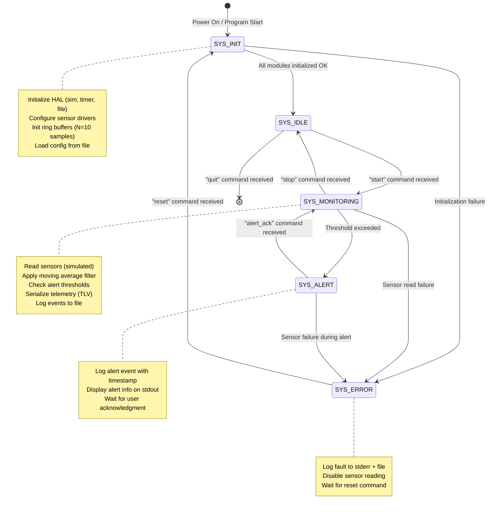
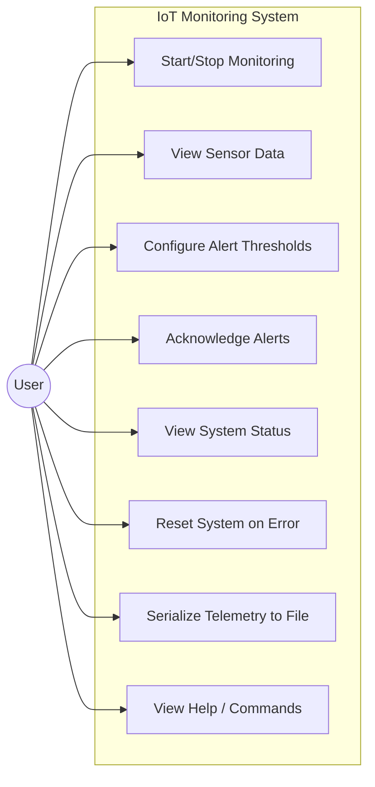

> **📣 Message from your instructor:**
>
> Hi folks,
>
> Congratulations on completing all 16 lectures of the Advanced C Programming course!
> This final project is your capstone — it integrates everything you have learned into
> a single, industry-grade embedded C application. Treat this like a real sprint at work:
> plan your tasks, follow the Git workflow, pass all quality gates, and deliver on time.
>
> This advanced C programming course recommends young engineers to code on your own!
> If possible, let's first try to write code from scratch. If it's hard, you guys can
> ask AI coding tool assistant! Don't let AI agent generate code for you!!
>
> Happy coding geeks! 🚀

---

# Final Project — IoT Environmental Monitoring System (Desktop Simulation)

**Deadline: 2026-10-15 23:59:00**
**Duration: 2 weeks (1 sprint)**

---

> [!CAUTION]
> # ⚠️ READ THIS FIRST — This Is NOT Like Your Weekly Homework
>
> For 16 weeks you submitted homework by creating `Exercise_N/` folders **inside the
> class homework repository**. This final project works differently, and if you start
> the old way you will have to redo your work.
>
> **You build this project in YOUR OWN GitHub repository, and you submit it TWICE.**
>
> | | Weekly homework (L1–L16) | This final project |
> |:---|:---|:---|
> | Where you write code | Class repo, `session-XX/Exercise_N/` | **Your own public repository** |
> | Branches | One branch for the session | `main` + `develop` + one `feature/IOT-00N-*` per task |
> | Pull Requests | 1 PR to the class repo | ~8 PRs **inside your own repo**, then 1 PR to the class repo |
> | CI | The class repo runs it for you | **You write your own CI pipeline** (Task_8) |
> | Delivery | Push your code | Tag a release `v1.0.0`, *then* submit |
> | Scored on | Code only | Code (90 pts) **+ how you worked** (10 pts) |
>
> ### The whole journey, start to finish
>
> ```text
>  1. CREATE your own public GitHub repo, set up main + develop      → Section 5.0
>         │
>  2. For each task IOT-001 … IOT-008:                               → Section 5.4
>         │   git checkout develop
>         │   git checkout -b feature/IOT-00N-<slug>
>         │   ...write code, commit as "IOT-00N: ..."
>         │   push → open PR → self-review → squash merge to develop
>         │
>  3. RELEASE: develop → release/v1.0.0 → main, tag v1.0.0           → Section 5.4 step 6
>         │
>  4. Put the repo marker in your README.md                          → Task_8
>         │
>  5. COPY the project into the class homework repo and open a PR    → Section 5.6
> ```
>
> **Steps 1–4 happen in your repository. Only step 5 touches the class repository.**
>
> Skipping steps 1–4 and submitting only step 5 still passes (max 90/100). Doing the
> whole process earns up to 100/100 — see [Section 12](#12-how-your-final-project-is-scored).

---

## Table of Contents

1. [Project Overview](#1-project-overview)
2. [Real-World Industry Context](#2-real-world-industry-context)
3. [System Architecture (SA — Solutions Architect)](#3-system-architecture-sa--solutions-architect)
4. [Sprint Planning (PM/PO — Project Manager / Product Owner)](#4-sprint-planning-pmpo--project-manager--product-owner)
5. [Developer Workflow](#5-developer-workflow)
6. [Quality Gate & CMake Mandatory Requirement](#6-quality-gate--cmake-mandatory-requirement)
7. [Common Rules for All Tasks](#7-common-rules-for-all-tasks)
8. [Task Breakdown](#8-task-breakdown)
   - [Task_1 — Project Scaffolding & HAL Simulation Layer (Easy)](#task_1-build--easy--project-scaffolding--hal-simulation-layer)
   - [Task_2 — Industrial Logger Module with Macros & Variadic Functions (Easy)](#task_2-build--easy--industrial-logger-module-with-macros--variadic-functions)
   - [Task_3 — Sensor Drivers with OOP Encapsulation & Polymorphism (Easy-Medium)](#task_3-build--easy-medium--sensor-drivers-with-oop-encapsulation--polymorphism)
   - [Task_4 — Ring Buffer, Moving Average Filter & Event Log (Medium)](#task_4-build--medium--ring-buffer-moving-average-filter--event-log)
   - [Task_5 — TLV Telemetry Serialization & Deserialization (Medium)](#task_5-build--medium--tlv-telemetry-serialization--deserialization)
   - [Task_6 — Application FSM & CLI Command Dispatcher (Medium-Difficult)](#task_6-build--medium-difficult--application-fsm--cli-command-dispatcher)
   - [Task_7 — System Integration, Config Persistence & Main Loop (Difficult)](#task_7-build--difficult--system-integration-config-persistence--main-loop)
   - [Task_8 — GitHub Actions CI, SWE Documentation & Release (Difficult)](#task_8-build--difficult--github-actions-ci-swe-documentation--release)
9. [Lecture Coverage Matrix](#9-lecture-coverage-matrix)
10. [Complete Project Directory Structure](#10-complete-project-directory-structure)
11. [Aggregate Coding Standards Reference](#11-aggregate-coding-standards-reference)
12. [How Your Final Project Is Scored](#12-how-your-final-project-is-scored)

---

## 1. Project Overview

### Problem Statement

Design and implement an **IoT Environmental Monitoring System** as a desktop simulation in C. The system reads simulated temperature and humidity sensor data, applies signal filtering (moving average), checks configurable alert thresholds, serializes telemetry packets using TLV (Tag-Length-Value) protocol, logs all events to a file, and is controlled by a command-line interface driven by a Finite State Machine (FSM).

The entire application runs on a desktop (Linux/WSL) — **no real hardware required**. Sensor readings are simulated via a HAL (Hardware Abstraction Layer) using pseudo-random number generation. File-based I/O replaces cloud communication. The architecture follows a 4-layer Clean Architecture pattern used in production embedded systems.

### What You Will Build

| Component | Directory | Description |
|:---|:---|:---|
| **Common** | `components/common/` | Shared types (`common_types.h`), Design-by-Contract macros (`contract.h`) |
| **HAL Layer** | `components/hal/` | Simulated hardware registers (`volatile`), timer ticks |
| **Logger** | `components/logger/` | Variadic logging macros, POSIX file I/O (cross-cutting) |
| **Driver Layer** | `components/drivers/` | Temperature & humidity sensor drivers with opaque pointer + sensor manager |
| **Data Services** | `components/data/` | Ring buffer, moving average filter, event log (intrusive linked list) |
| **Telemetry** | `components/telemetry/` | TLV binary serialization with CRC-8 |
| **Alert** | `components/alert/` | Configurable threshold alerting |
| **Config** | `components/config/` | Persistent config load/save with POSIX I/O |
| **Application** | `components/app/` | System FSM (function pointer table), CLI command dispatcher |
| **Main** | `app/` | Main application loop wiring all components |
| **Tests** | `test/` | Unity unit tests (one suite per component) |
| **Infrastructure** | `.github/`, `docs/` | CMake build system, GitHub Actions CI, SWE documentation |

### Task Overview

| Task | Name | Difficulty | Story Points |
|:---|:---|:---|:---:|
| Task_1 | Project Scaffolding & HAL Simulation Layer | ⭐ Easy | 3 |
| Task_2 | Industrial Logger Module | ⭐ Easy | 3 |
| Task_3 | Sensor Drivers with OOP & Polymorphism | ⭐⭐ Easy-Medium | 5 |
| Task_4 | Ring Buffer, Moving Average & Event Log | ⭐⭐ Medium | 5 |
| Task_5 | TLV Telemetry Serialization | ⭐⭐ Medium | 5 |
| Task_6 | Application FSM & CLI Dispatcher | ⭐⭐⭐ Medium-Difficult | 8 |
| Task_7 | System Integration & Main Loop | ⭐⭐⭐ Difficult | 8 |
| Task_8 | CI Pipeline, SWE Docs & Release | ⭐⭐⭐ Difficult | 5 |
| | **Total** | | **42** |

---

## 2. Real-World Industry Context

Smart building environmental monitoring is a core application in the IoT and embedded systems industry. Companies such as **Honeywell**, **Siemens**, **Bosch**, and **Schneider Electric** deploy sensor networks in office buildings, data centers, hospitals, and factories to monitor temperature, humidity, and air quality in real time.

**How these systems work in production:**
- **Sensors** (I2C/SPI) read environmental data at fixed intervals (e.g., 1 Hz).
- A **moving average filter** (circular buffer) smooths noisy sensor readings.
- **Configurable thresholds** trigger alerts (buzzer, LED, MQTT notification) when conditions exceed safe ranges.
- **Telemetry packets** are serialized in binary protocols (TLV, Protocol Buffers, or custom wire formats) and transmitted to a cloud backend over MQTT/HTTP.
- The system is controlled by a **Finite State Machine** with states: INIT → IDLE → MONITORING → ALERT → ERROR.
- The entire codebase follows **MISRA-C / CERT-C / BARR-C** coding standards, uses **CMake + Unity** for TDD, and is integrated into a **CI/CD pipeline** (GitHub Actions, Jenkins, or GitLab CI).

**After completing this project, you will:**
- Understand how production embedded C applications are structured using Clean Architecture.
- Be able to implement a full project following Agile Scrum sprint workflow.
- Know how to set up CI pipelines, quality gates, and release processes used in the industry.
- Have a portfolio-ready project to discuss in technical interviews.

---

## 3. System Architecture (SA — Solutions Architect)

### 3.1 Component Diagram (Layered Architecture)

```text
┌─────────────────────────────────────────────────────────────────────────┐
│                         APPLICATION LAYER                               │
│  ┌─────────────┐  ┌─────────────┐  ┌─────────────┐  ┌─────────────┐   │
│  │ components/  │  │ components/  │  │ components/  │  │ components/  │   │
│  │    app/      │  │   alert/     │  │   config/    │  │   (cli in    │   │
│  │  app_fsm     │  │   alert      │  │   config     │  │    app/)     │   │
│  │  cli_cmd     │  │              │  │              │  │              │   │
│  └──────┬───────┘  └──────┬───────┘  └──────┬───────┘  └──────┬───────┘   │
├─────────┼─────────────────┼─────────────────┼─────────────────┼──────────┤
│         │           SERVICE LAYER            │                 │          │
│  ┌──────▼───────┐  ┌──────▼───────┐  ┌──────▼───────┐  ┌─────▼────────┐ │
│  │ components/  │  │ components/  │  │ components/  │  │ components/  │ │
│  │  drivers/    │  │    data/     │  │  telemetry/  │  │   logger/    │ │
│  │  sensor_mgr  │  │  data_proc   │  │  telemetry   │  │   logger     │ │
│  └──────┬───────┘  └──────────────┘  └──────────────┘  └──────────────┘ │
├─────────┼────────────────────────────────────────────────────────────────┤
│         │           DRIVER LAYER                                         │
│  ┌──────▼───────┐  ┌──────────────┐   (inside components/drivers/)       │
│  │   temp_drv   │  │   humi_drv   │                                      │
│  └──────┬───────┘  └──────┬───────┘                                      │
├─────────┼─────────────────┼──────────────────────────────────────────────┤
│         │            HAL LAYER                                           │
│  ┌──────▼───────┐  ┌──────▼───────┐    (components/hal/)                 │
│  │   hal_sim    │  │  hal_timer   │                                      │
│  └──────────────┘  └──────────────┘                                      │
│        │                │                                                │
│   [rand()/seed]    [clock()/tick]                                        │
├──────────────────────────────────────────────────────────────────────────┤
│  ┌──────────────────────────────────┐    (components/common/)            │
│  │  common_types.h  │  contract.h  │    INTERFACE lib — used by ALL      │
│  └──────────────────────────────────┘                                    │
└──────────────────────────────────────────────────────────────────────────┘
```

**Dependency Rule**: Each layer depends **only** on the layer directly below it. The Application Layer never calls HAL functions directly — it goes through Service → Driver → HAL. This is the **Clean Architecture Dependency Rule**.

**Directory ↔ Architecture Rule**: Each component in the diagram maps **1:1 to a subdirectory** under `components/`. Each component has its own `CMakeLists.txt` that declares only the dependencies it actually uses. CMake enforces the layered dependency rule at build time — if a component tries to include a header from a component it does not depend on, the build will fail.

### 3.2 System State Diagram (FSM)



### 3.3 Sequence Diagram — Sensor Read + Alert Flow

```mermaid
sequenceDiagram
    participant FSM as App_FSM (MONITORING)
    participant SM as SensorMgr
    participant DP as DataProc (Moving Avg)
    participant DRV as TempDriver
    participant HAL as HAL_Sim
    participant ALT as AlertModule
    participant TLM as Telemetry
    participant LOG as Logger

    FSM->>SM: sensor_mgr_read_all()

    SM->>DRV: temp_drv_read(&raw_data)
    DRV->>HAL: hal_sim_read_register(TEMP_REG)
    HAL-->>DRV: raw_value = 0x0C80 (simulated)
    DRV-->>SM: 25.3 (calibrated, fixed-point Q8.8)

    SM->>DP: data_proc_filter(SENSOR_TEMP, 25.3)
    Note over DP: Ring buffer stores last N=10 samples. Computes O(1) moving average.
    DP-->>SM: 25.1 (filtered)

    SM-->>FSM: sensor_data_t {temp=25.1, humi=60.2}

    FSM->>TLM: telemetry_serialize(&sensor_data, p_buf)
    Note over TLM: Pack into TLV: [SYNC][LEN][TYPE][DATA][CRC]

    FSM->>LOG: LOG_INFO("Temp=25.1 Humi=60.2")

    FSM->>ALT: alert_check(&sensor_data, &thresholds)
    alt Temperature > max_threshold (e.g., 35.0)
        ALT-->>FSM: ALERT_TRIGGERED
        FSM->>LOG: LOG_WARN("ALERT: Temp exceeded threshold!")
        Note over FSM: Transition to SYS_ALERT state
    else All values within range
        ALT-->>FSM: ALERT_NONE
        Note over FSM: Remain in SYS_MONITORING state
    end
```

### 3.4 Use Case Diagram



### 3.5 Architecture-to-Codebase Mapping (Industry Best Practice)

> **Why does the directory structure mirror the component diagram?**
>
> In production embedded systems (ESP-IDF, Zephyr RTOS, automotive AUTOSAR), the codebase is organized as **self-contained components** — each with its own `include/`, `src/`, and build file. This is not cosmetic — it **enforces the architecture through the build system**. If the component diagram says "drivers depend on HAL but not on app", then the `components/drivers/CMakeLists.txt` links only to `hal` and `common`. A developer who accidentally `#include "app_fsm.h"` inside a driver file will get a **build error**, not a silent architecture violation.

**Component → Directory → CMake Target Mapping:**

| Architecture Layer | Component | Directory | CMake Target | Dependencies |
|:---|:---|:---|:---|:---|
| Common (INTERFACE) | Shared types, DbC macros | `components/common/` | `common` | *(none)* |
| HAL | Simulated registers, timer | `components/hal/` | `hal` | `common` |
| Cross-cutting | Logger with POSIX I/O | `components/logger/` | `logger` | `common` |
| Driver | Sensor drivers + manager | `components/drivers/` | `drivers` | `common`, `hal` |
| Service | Ring buffer, filter, event log | `components/data/` | `data` | `common` |
| Service | TLV serialization | `components/telemetry/` | `telemetry` | `common` |
| Application | Alert thresholds | `components/alert/` | `alert` | `common`, `logger` |
| Application | Config persistence | `components/config/` | `config` | `common`, `logger`, `alert` |
| Application | FSM + CLI dispatcher | `components/app/` | `app` | `common`, `logger` |
| Executable | Main loop | `app/` | `iot_monitor` | *all components* |
| Tests | Unity test suites | `test/` | `test_*` | *per-component* |

**CMake Dependency Graph (enforces Clean Architecture):**

```text
                    common (INTERFACE)
                   /   |   \      \
                 hal  logger  \     \
                 /      |      \     \
            drivers   alert   data  telemetry
                        |
                      config

                       app (depends on: common, logger)

         iot_monitor (links ALL components)
         test_*      (links ONLY tested component + its deps)
```

**Key principle**: Each `components/<name>/CMakeLists.txt` is typically just 3-5 lines:
```cmake
add_library(<name> STATIC src/<file>.c)
target_include_directories(<name> PUBLIC include)
target_link_libraries(<name> PUBLIC <dependency1> <dependency2>)
```

The `PUBLIC` keyword propagates include paths transitively — so when `drivers` links to `hal`, any target that links to `drivers` also gets access to `hal`'s headers automatically. This is how CMake enforces the layered dependency rule.

---

## 4. Sprint Planning (PM/PO — Project Manager / Product Owner)

### 4.1 Sprint Goal

> **Sprint Goal (2 weeks, 10 working days):** Deliver a working IoT Environmental
> Monitoring System — build and unit-test every module (HAL, logger, sensor drivers,
> data structures, telemetry), integrate them behind the application FSM and main loop,
> implement config persistence, set up the CI pipeline, write the SWE documentation, and
> deliver a tagged `v1.0.0` release on the `main` branch.

**Mid-sprint checkpoint (end of day 5):** IOT-001 … IOT-005 complete — all five modules
independently unit-tested and passing the 4 quality gates. If you are behind at this
point, raise it with your instructor rather than silently cutting quality gates.

### 4.2 Product Backlog

| Ticket ID | Summary | Story Points | Priority | Difficulty |
|:---|:---|:---:|:---:|:---|
| IOT-001 | Set up CMake project with quality gates & HAL simulation layer | 3 | P1 — Must | Easy |
| IOT-002 | Implement variadic logging module with POSIX file output | 3 | P1 — Must | Easy |
| IOT-003 | Implement sensor HAL interface, temperature & humidity drivers | 5 | P1 — Must | Easy-Medium |
| IOT-004 | Implement ring buffer, moving average filter & event log | 5 | P1 — Must | Medium |
| IOT-005 | Implement TLV telemetry serialization & deserialization | 5 | P2 — Should | Medium |
| IOT-006 | Implement system FSM & CLI command dispatcher | 8 | P2 — Should | Medium-Difficult |
| IOT-007 | Integrate all modules, config persistence & main loop | 8 | P2 — Should | Difficult |
| IOT-008 | Set up GitHub Actions CI, write architecture docs & release v1.0.0 | 5 | P3 — Could | Difficult |

### 4.3 Work Breakdown Structure (WBS) & Sprint Plan

**Sprint Duration:** 2 weeks / 1 sprint (10 working days)
**Committed Scope:** 42 story points across 8 tickets

#### Sprint 1 — IoT Monitoring System v1.0.0 (Weeks 1-2, 42 SP)

| Day | Ticket | Focus | Deliverable | SP |
|:---:|:---|:---|:---|:---:|
| 1 | IOT-001 | CMake scaffolding, quality gates, HAL sim + timer | Build system green, HAL unit tests pass | 3 |
| 2 | IOT-002 | Logger macros, variadic functions, POSIX file I/O | Logger tested, file output verified | 3 |
| 3 | IOT-003 | Sensor interface, opaque pointers, temp + humi drivers | Polymorphic sensor read working | 5 |
| 4 | IOT-004 | Ring buffer, moving average, intrusive linked list event log | All data structure unit tests pass | 5 |
| 5 | IOT-005 | TLV serialization, endianness, safe parsing | Telemetry round-trip test passes | 5 |
| 6-7 | IOT-006 | FSM state handlers, function pointer table, CLI dispatcher | FSM + CLI working end-to-end | 8 |
| 8-9 | IOT-007 | Main loop, module wiring, config file, Design-by-Contract | Full system runs as simulation | 8 |
| 10 | IOT-008 | CI pipeline, architecture docs, sprint docs, tag v1.0.0 | All gates green, release complete | 5 |

**Sprint Review (end of day 10):** Full system integration tested, CI pipeline green,
documentation complete, `v1.0.0` tagged on `main`.

> [!WARNING]
> **This is an aggressive sprint — plan accordingly.** 42 story points in 10 days is a
> deliberately demanding commitment, and the Story Point Reference Guide (Section 4.5)
> puts the raw effort closer to 13 days than 10. That gap is the point: real sprints are
> planned under pressure, and part of this project is learning to handle it
> professionally.
>
> **If you fall behind, do NOT cut quality gates.** A junior who delivers IOT-001 …
> IOT-006 with every gate green scores far better than one who delivers all 8 tickets
> with a broken build — the tasks are weighted independently (Section 12). Prioritise by
> the backlog's priority column: finish every **P1 — Must** ticket first, then **P2**,
> then **P3**. Raise the risk at the day-5 checkpoint, exactly as you would in a real
> stand-up.

### 4.4 Definition of Done (DoD)

Every task is considered "done" when ALL of the following are met:

- [ ] Code compiles with zero warnings (`-Wall -Wextra -pedantic -Werror -std=c11`)
- [ ] All Unity unit tests pass (including under ASan + UBSan)
- [ ] Static analysis clean: `cppcheck` + `clang-tidy` report 0 warnings
- [ ] Pre-commit hooks pass: `pre-commit run --all-files`
- [ ] Doxygen comments on all public functions, structs, and enums
- [ ] BARR-C naming conventions followed (`p_` prefix, `uint32_t` types, mandatory braces)
- [ ] Committed with ticket ID prefix (e.g., `IOT-003: implement temperature driver`)
- [ ] Feature branch merged to `develop` via Pull Request

### 4.5 Story Point Reference Guide

| Story Points | Effort Level | Example |
|:---:|:---|:---|
| 1-2 | Trivial — a few hours | Fix a typo, add a missing header guard |
| 3 | Easy — about 1 day | Set up build system, implement a standalone module |
| 5 | Medium — 1-2 days | Module with dependencies, algorithm implementation |
| 8 | Difficult — 2-3 days | Multi-module integration, complex FSM, system wiring |
| 13+ | Epic — break it down | Too large for a single task, should be split |

---

## 5. Developer Workflow

### 5.0 Step 0 — Create Your Own Project Repository

> [!IMPORTANT]
> Do this **before you write a single line of code**. Everything in Sections 5.1–5.5
> happens inside this repository, not in the class homework repository.

**Why your own repository?** This project requires you to create branches, open and merge
Pull Requests, run GitHub Actions, and publish a release tag. You do not have permission
to do any of that in the class repository — and learning to drive a repository yourself is
half of what this project teaches (requirement: L15 SWE Dev Process).

**1. Create the repository on GitHub**

- Name: `iot_monitoring_system` (or your own name)
- Visibility: **Public** — required so the scoring system can verify your process
- Do **not** add a README, .gitignore or license; you will write these yourself in Task_8

**2. Set up the two long-lived branches**

```bash
git clone git@github.com:<your-username>/iot_monitoring_system.git
cd iot_monitoring_system

# main — production branch
git commit --allow-empty -m "IOT-000: initialize repository"
git branch -M main
git push -u origin main

# develop — integration branch, where all feature branches merge
git checkout -b develop
git push -u origin develop
```

**3. Confirm your starting point**

```bash
git branch -a
#   develop        ← you are here
#   main
#   remotes/origin/develop
#   remotes/origin/main
```

You are now ready for Task_1. From here on, **never commit directly to `main` or
`develop`** — always work on a `feature/IOT-00N-*` branch and merge via a Pull Request.

### 5.1 Git Branch Model

```text
main ───────────────────────────────────────────────────── [v1.0.0 tag]
  │                                                              ▲
  └─> develop ──────────────────────────────────────────────────┘
        │     ▲     ▲     ▲     ▲     ▲     ▲     ▲     ▲
        │     │     │     │     │     │     │     │     │
        └─> feature/IOT-001-project-scaffolding ──┘     │
              └─> feature/IOT-002-logger ──────────┘     │
                    └─> feature/IOT-003-sensor-drivers ──┘
                          ... (one branch per ticket) ...
```

**Branches:**
- `main` — Production-ready code. Only receives merges from `release/*`. Tagged with semantic versions.
- `develop` — Integration branch. All feature branches merge here.
- `feature/IOT-NNN-short-description` — One branch per backlog ticket.
- `bugfix/IOT-NNN-short-description` — For bug fixes discovered during integration.
- `release/v1.0.0` — Created from `develop` at end of sprint, merged to `main`, tagged.

### 5.2 Branch Naming Convention

```text
feature/IOT-001-project-scaffolding
feature/IOT-002-logger-module
feature/IOT-003-sensor-drivers
bugfix/IOT-006-fsm-null-check
release/v1.0.0
```

### 5.3 Commit Message Convention

```text
IOT-NNN: imperative description of change

Examples:
IOT-001: add root CMakeLists.txt with quality gate scaffolding
IOT-001: implement HAL simulation layer with volatile registers
IOT-003: implement temperature driver with opaque pointer pattern
IOT-006: add FSM function pointer table with bounds check
IOT-008: add GitHub Actions CI pipeline with 4 quality stages
```

### 5.4 Pull Request & Merge Workflow

```text
1. Create feature branch from develop:
   $ git checkout develop
   $ git pull origin develop
   $ git checkout -b feature/IOT-003-sensor-drivers

2. Implement the task, commit with ticket ID prefix:
   $ git add -A
   $ git commit -m "IOT-003: implement sensor HAL interface with function pointers"

3. Push and create Pull Request:
   $ git push origin feature/IOT-003-sensor-drivers
   → Create PR on GitHub targeting "develop"

4. Self-Review Checklist (before approving your own PR):
   [ ] Builds clean: cmake -B build && cmake --build build
   [ ] Tests pass: ctest --test-dir build -V
   [ ] Static analysis: cmake --build build --target cppcheck
   [ ] Pre-commit: pre-commit run --all-files
   [ ] Doxygen comments complete
   [ ] No TODO/FIXME left behind

5. Squash merge into develop:
   → On GitHub, select "Squash and merge"
   → Delete the feature branch after merge

6. Release process (end of sprint):
   $ git checkout develop
   $ git checkout -b release/v1.0.0
   → Final testing, fix any last issues
   $ git checkout main
   $ git merge release/v1.0.0
   $ git tag -a v1.0.0 -m "Release v1.0.0: IoT Monitoring System"
   $ git push origin main --tags
```

### 5.5 GitHub Actions CI Pipeline

When you push code to any branch, CI automatically runs 4 stages:

```text
┌──────────────────┐     ┌──────────────────┐     ┌──────────────────┐     ┌──────────────────┐
│  Stage 1:        │     │  Stage 2:        │     │  Stage 3:        │     │  Stage 4:        │
│  Checkout +      │────>│  Pre-commit      │────>│  Build + Static  │────>│  Unit Tests +    │
│  Dependencies    │     │  Check           │     │  Analysis        │     │  Sanitizers      │
└──────────────────┘     └──────────────────┘     └──────────────────┘     └──────────────────┘
```

The CI YAML template is provided in Task_8.

### 5.6 Submitting Your Final Project to the Class Homework Repository

> [!IMPORTANT]
> Do this **only after** you have tagged `v1.0.0` in your own repository. Submitting a
> half-finished project early and overwriting it later wastes your reviewer's time.

Your own repository is where you *build*. The class homework repository is where you
*submit*. The submission is a copy of your finished project — **not** a link, and **not**
a git submodule.

**Step 1 — Check your `README.md` carries the repository marker**

```markdown
<!-- FINAL_PROJECT_REPO: https://github.com/<your-username>/iot_monitoring_system -->
```

Without this line, the scoring system cannot find your repository and you lose the
10 process points (see [Section 12](#12-how-your-final-project-is-scored)).

**Step 2 — Create your submission branch in the class repo**

Same rules as every weekly homework: sync your fork first, then branch from `master`.

```bash
cd ~/devlinux                     # your fork of the class homework repo
git checkout master
git pull                          # ALWAYS pull master before branching
git checkout -b c-advance/K26.1/<your-name>/final-project
```

> ⚠️ Confirm the exact branch name and folder path with your instructor — the class
> repository owns that convention, and it may differ from the example above.

**Step 3 — Copy your project across, without the git metadata**

```bash
rsync -av \
  --exclude='.git' \
  --exclude='build*' \
  --exclude='*.o' \
  --exclude='*.log' \
  ~/iot_monitoring_system/ \
  c-advance/K26.1/<your-name>/final-project/
```

> [!WARNING]
> **Never copy the `.git` folder.** It turns your submission into a repository nested
> inside another repository, and your files will silently fail to upload.
>
> **Do** copy `.github/workflows/ci.yml` — it is a graded Task_8 deliverable. It will not
> execute inside the class repository (only workflows at the repository root run), and
> that is expected: it is reviewed as a file, and its real execution is verified in your
> own repository.

**Step 4 — Verify what you are about to submit**

```bash
cd c-advance/K26.1/<your-name>/final-project/
ls -a          # must show: CMakeLists.txt .clang-tidy .pre-commit-config.yaml
               #            .github/ components/ app/ test/ docs/ README.md
               # must NOT show: .git/ build/ build-asan/

# Prove it still builds from the copy, exactly as the scoring system will:
cmake -B build -DCMAKE_BUILD_TYPE=Debug && cmake --build build
cmake -B build-asan -DSANITIZER=asan+ubsan -DCMAKE_C_CLANG_TIDY="" \
  && cmake --build build-asan && ctest --test-dir build-asan -V
rm -rf build build-asan        # remove build output before committing
```

**Step 5 — Commit, push, open the Pull Request**

```bash
cd ~/devlinux
git add c-advance/K26.1/<your-name>/final-project/
git commit -m "c-advance K26.1 final-project: IoT Monitoring System v1.0.0"
git push origin c-advance/K26.1/<your-name>/final-project
```

Then open a PR against the class repository's `master`, titled:

```text
[C Advance K26.1 Final Project] <Your Full Name>
```

**Step 6 — Respond to the automated review**

The scoring system posts a scorecard on your PR. If you need to fix something, fix it
**in your own repository first** (on a `bugfix/IOT-00N-*` branch, merged properly), then
re-copy and push to the same submission branch. Do not hand-patch the submitted copy —
your repository and your submission must match, and the scoring system checks this.

---

## 6. Quality Gate & CMake Mandatory Requirement

> [!IMPORTANT]
> **Quality Gate & CMake Mandatory Requirement**
> This final project follows the same quality gate standards as L13-L16 homework. Your project must satisfy four automated verification gates:
>
> 1. **Gate 1 — Pre-commit Tool Check**: You must provide `.pre-commit-config.yaml` and `.clang-tidy`. Running `pre-commit run --all-files` locally must pass with zero errors.
> 2. **Gate 2 — Compiler & Clang-Tidy Build Check**: Your `CMakeLists.txt` must set `CMAKE_C_CLANG_TIDY` and strict flags (`-Wall -Wextra -pedantic -Werror -std=c11`). Running `cmake -B build && cmake --build build` must build cleanly with zero compiler warnings and zero `clang-tidy` diagnostics.
> 3. **Gate 3 — Static Analysis Check**: Your `CMakeLists.txt` must provide a custom target for `cppcheck`. Running `cmake --build build --target cppcheck` must complete with zero warnings.
> 4. **Gate 4 — Sanitizer & Unit Test Check**: Your `CMakeLists.txt` must support `-DSANITIZER=asan+ubsan`. Running `cmake -B build-asan -DSANITIZER=asan+ubsan && cmake --build build-asan && ctest --test-dir build-asan -V` must execute all Unity unit tests with zero memory errors or undefined behavior crashes.
>
> **How to generate starter configuration files:**
> - Generate default `.clang-tidy`:
>   ```bash
>   clang-tidy -dump-config > .clang-tidy
>   ```
> - Generate default `.pre-commit-config.yaml`:
>   ```bash
>   pre-commit sample-config > .pre-commit-config.yaml
>   ```

---

## 7. Common Rules for All Tasks

Every `[build]` task in this project must follow these rules:

1. **BARR-C Coding Style**: Use fixed-width integers (`uint8_t`, `int32_t`, etc.), `p_` prefix for pointer parameters, mandatory braces on all `if`/`else`/`for`/`while` blocks.
2. **Code Documentation**: All functions, data structures, and enums **MUST** be fully documented using Doxygen-style comments (`/** @brief ... */`).
3. **Static Analysis**: Use `cppcheck` and `clang-tidy` to analyze. Ensure there are no warning or error messages.
4. **Compiler Flags**: Compile with `-Wall -Wextra -pedantic -Werror -std=c11`.
5. **No Dynamic Memory Allocation**: Per MISRA Dir 4.12, avoid `malloc`/`free` in the core application path. Use static allocation, object pools, or stack-based structures.
6. **Design-by-Contract**: Critical module entry points must use `REQUIRE`/`ENSURE`/`INVARIANT` macros (from `include/contract.h`).
7. **POSIX Feature Test Macro**: Add `-D_POSIX_C_SOURCE=200809L` for POSIX file I/O functions.

---

## Important: How This Project Differs from Homework

This final project uses the **same C concepts** you learned in L1-L16 homework, but applies them in a **completely different context** — a multi-module, system-level IoT application. Key differentiations:

| Concept | Previous Homework | Final Project |
|:---|:---|:---|
| **Ring Buffer** | L12: `uint8_t` byte buffer, standalone SPSC exercise | `int16_t` sensor readings, integrated into moving average filter pipeline |
| **Moving Average** | L12: Standalone filter exercise | Part of a continuous monitoring data pipeline with live sensor input |
| **FSM** | L6: Traffic light controller / WiFi connection FSM | IoT system controller with 5 states, CLI-driven events, and alert integration |
| **Command Dispatcher** | L6: LED/MOTOR string-driven jump table | IoT CLI with 7 commands driving FSM events + status display |
| **Logger** | L7: Text-only stdout logger | Dual output (stdout + POSIX file I/O), integrated into every module |
| **OOP Drivers** | L4: Polymorphic display driver | Temperature + humidity sensor drivers with calibration offsets |
| **Serialization** | L4: Simple endian-safe packet parser | Full TLV protocol with CRC-8, multi-packet serialization, corrupt packet rejection |
| **Linked List** | L12: Sorted sensor event list (standalone) | Alert event log with static memory pool and bounded eviction policy |
| **DbC Contracts** | L13: Ring buffer with contracts (standalone) | Contracts embedded across ALL modules as cross-cutting quality enforcement |
| **POSIX I/O** | L14: Structured log writer (standalone) | Config file load/save + log file output as part of system integration |
| **Quality Gates** | L13: Per-exercise quality gates | Project-wide CMake quality infrastructure shared across 15+ source files |
| **CI Pipeline** | Not in any homework | Full GitHub Actions CI with 4 stages |

The **key difference**: homework exercises are standalone, isolated exercises. This project integrates ALL concepts into a single, layered application where modules depend on each other — just like a real production codebase.

---

## 8. Task Breakdown

---

### Task_1 [build] — Easy — Project Scaffolding & HAL Simulation Layer

**Ticket:** `IOT-001` · **Feature branch:** `feature/IOT-001-<slug>` · **Story Points:** 3 · **Weight:** 6% of final score

### 📂 File Deliverables Breakdown

| File Path | Status | Description |
|---|---|---|
| `CMakeLists.txt` | **[MUST IMPLEMENT]** | Root CMake: compiler flags, sanitizers, `add_subdirectory(components)`, `add_subdirectory(app)`, `add_subdirectory(test)`. |
| `components/CMakeLists.txt` | **[MUST IMPLEMENT]** | Component registry: `add_subdirectory()` for each component. |
| `components/common/CMakeLists.txt` | **[MUST IMPLEMENT]** | INTERFACE library for shared headers. |
| `components/hal/CMakeLists.txt` | **[MUST IMPLEMENT]** | HAL static library, depends on `common`. |
| `test/CMakeLists.txt` | **[MUST IMPLEMENT]** | Unity via FetchContent, test targets with per-component linking. |
| `.clang-tidy` | **[MUST CONFIGURE]** | Static analysis configuration. |
| `.pre-commit-config.yaml` | **[MUST CONFIGURE]** | Pre-commit hook configuration. |
| `components/common/include/common_types.h` | **[MUST IMPLEMENT]** | Project-wide enums (`system_state_t`, `sensor_type_t`, `status_t`), error codes, fixed-width typedefs. |
| `components/common/include/contract.h` | **[MUST IMPLEMENT]** | Design-by-Contract macros (`REQUIRE`, `ENSURE`, `INVARIANT`). |
| `components/hal/include/hal_sim.h` | **[MUST IMPLEMENT]** | HAL simulation interface: simulated register read/write using `volatile` static variables. |
| `components/hal/src/hal_sim.c` | **[MUST IMPLEMENT]** | HAL simulation: pseudo-random sensor values via `rand()` with configurable seed. |
| `components/hal/include/hal_timer.h` | **[MUST IMPLEMENT]** | Timer simulation interface: tick counter. |
| `components/hal/src/hal_timer.c` | **[MUST IMPLEMENT]** | Timer simulation: static tick counter incremented on each call. |
| `test/test_hal_sim.c` | **[MUST IMPLEMENT]** | Unity unit tests for HAL simulation functions. |

---

### Problem Statement

Set up the entire project build infrastructure and implement the lowest layer of the system — the HAL (Hardware Abstraction Layer) simulation. This layer provides simulated hardware register access for sensor drivers and a tick-based timer for the application.

In production embedded systems, the HAL layer directly accesses MCU peripheral registers through memory-mapped I/O pointers (e.g., `*(volatile uint32_t *)0x40021000`). In this desktop simulation, you will simulate this pattern using `volatile` static variables that are read/written through HAL API functions, and sensor values generated with `rand()` seeded by a configurable seed.

**Requirements:**

1. Create the **component-based CMake build system** (see Section 3.5 and Design Hints below):
   - Root `CMakeLists.txt`: compiler flags, quality gates (clang-tidy, cppcheck, sanitizers).
   - `components/CMakeLists.txt`: registers all component subdirectories.
   - Per-component `CMakeLists.txt`: each component is a `STATIC` or `INTERFACE` library with explicit dependencies.
   - `test/CMakeLists.txt`: Unity via FetchContent, test targets linked to specific components.
2. Define project-wide types in `components/common/include/common_types.h`:
   - `system_state_t` enum: `SYS_INIT`, `SYS_IDLE`, `SYS_MONITORING`, `SYS_ALERT`, `SYS_ERROR`, `SYS_NUM_STATES`
   - `sensor_type_t` enum: `SENSOR_TEMPERATURE`, `SENSOR_HUMIDITY`, `SENSOR_NUM_TYPES`
   - `status_t` enum: `STATUS_OK`, `STATUS_ERR_NULL_PTR`, `STATUS_ERR_INVALID_PARAM`, `STATUS_ERR_TIMEOUT`, `STATUS_ERR_FULL`, `STATUS_ERR_EMPTY`
   - All enums must use explicit `uint8_t` or `uint32_t` backing where appropriate.
3. Implement `contract.h` with `REQUIRE`, `ENSURE`, `INVARIANT` macros that:
   - Print the failed condition, file, line, and function name, then call `abort()`.
   - Compile to `((void)0)` when `NDEBUG` is defined.
4. Implement `hal_sim.h/.c`:
   - `void hal_sim_init(uint32_t seed)` — Initialize the random seed.
   - `uint16_t hal_sim_read_register(uint8_t reg_addr)` — Return a simulated sensor value from a `volatile` static register array. The register array must be declared as `static volatile uint16_t s_registers[...]`.
   - `void hal_sim_write_register(uint8_t reg_addr, uint16_t value)` — Write to a simulated register.
   - `void hal_sim_update(void)` — Generate new pseudo-random sensor values and store in registers.
5. Implement `hal_timer.h/.c`:
   - `void hal_timer_init(void)` — Reset tick counter.
   - `uint32_t hal_timer_get_tick(void)` — Return current tick.
   - `void hal_timer_tick(void)` — Increment tick by 1.
6. Write Unity unit tests verifying: HAL init sets seed, register read/write works, timer increments correctly.

**Quality Gate Rules:**
- **Pre-commit Gate**: `pre-commit run --all-files` — 0 errors.
- **Build & Clang-Tidy Gate**: `cmake -B build && cmake --build build` — 0 warnings.
- **Static Analysis Gate**: `cmake --build build --target cppcheck` — 0 defects.
- **Sanitizer & Test Gate**: `cmake -B build-asan -DSANITIZER=asan+ubsan && cmake --build build-asan && ctest --test-dir build-asan -V` — all tests pass.

---

### Design Hints

**1. Root `CMakeLists.txt` Template:**
```cmake
cmake_minimum_required(VERSION 3.14)
project(iot_monitor VERSION 1.0.0 LANGUAGES C)

set(CMAKE_C_STANDARD 11)
set(CMAKE_C_STANDARD_REQUIRED ON)
set(CMAKE_EXPORT_COMPILE_COMMANDS ON)

# Option: Sanitizers
set(SANITIZER "none" CACHE STRING "Sanitizer (none|asan|ubsan|asan+ubsan)")

# Gate 1: clang-tidy integration
find_program(CLANG_TIDY_EXE NAMES clang-tidy)
if(CLANG_TIDY_EXE)
    set(CMAKE_C_CLANG_TIDY ${CLANG_TIDY_EXE}
        --header-filter=${CMAKE_SOURCE_DIR}/components/.*)
    message(STATUS "[Quality Gate] clang-tidy: ENABLED")
endif()

# Gate 2: cppcheck custom target
find_program(CPPCHECK_EXE NAMES cppcheck)
if(CPPCHECK_EXE)
    add_custom_target(cppcheck
        COMMAND ${CPPCHECK_EXE}
            --enable=all --inconclusive --std=c11
            --suppress=missingIncludeSystem
            --suppress=unusedFunction
            --project=${CMAKE_BINARY_DIR}/compile_commands.json
            --error-exitcode=1
        WORKING_DIRECTORY ${CMAKE_SOURCE_DIR}
        COMMENT "[Quality Gate] Running cppcheck..."
    )
endif()

# Common compile options
add_compile_options(-Wall -Wextra -pedantic -Werror -std=c11 -D_POSIX_C_SOURCE=200809L)

# Sanitizer flags
if(SANITIZER STREQUAL "asan+ubsan")
    add_compile_options(-fsanitize=address,undefined -fno-omit-frame-pointer)
    add_link_options(-fsanitize=address,undefined)
endif()

# Components (layered architecture — see Section 3.5)
add_subdirectory(components)

# Main executable
add_subdirectory(app)

# Tests
enable_testing()
add_subdirectory(test)
```

**2. `components/CMakeLists.txt` — Component Registry:**
```cmake
# Order follows dependency rule: each layer depends only on layers above it.
add_subdirectory(common)
add_subdirectory(hal)
add_subdirectory(logger)
# Add more as you implement them in later tasks:
# add_subdirectory(drivers)    # Task 3
# add_subdirectory(data)       # Task 4
# add_subdirectory(telemetry)  # Task 5
# add_subdirectory(alert)      # Task 6
# add_subdirectory(config)     # Task 7
# add_subdirectory(app)        # Task 6
```

**3. Per-Component `CMakeLists.txt` Examples:**

`components/common/CMakeLists.txt` — header-only:
```cmake
add_library(common INTERFACE)
target_include_directories(common INTERFACE include)
```

`components/hal/CMakeLists.txt` — static library:
```cmake
add_library(hal STATIC src/hal_sim.c src/hal_timer.c)
target_include_directories(hal PUBLIC include)
target_link_libraries(hal PUBLIC common)
```

**4. `test/CMakeLists.txt` — Test Framework:**
```cmake
include(FetchContent)
FetchContent_Declare(unity
    GIT_REPOSITORY https://github.com/ThrowTheSwitch/Unity.git
    GIT_TAG        v2.6.0)
FetchContent_MakeAvailable(unity)

# Disable clang-tidy for third-party Unity sources
set_target_properties(unity PROPERTIES C_CLANG_TIDY "")

# Helper function: add a test linking to specific components
function(add_iot_test TEST_NAME SOURCE_FILE)
    add_executable(${TEST_NAME} ${SOURCE_FILE})
    target_link_libraries(${TEST_NAME} PRIVATE ${ARGN} unity)
    add_test(NAME ${TEST_NAME} COMMAND ${TEST_NAME})
endfunction()

# Test targets — each links ONLY the component(s) it tests
add_iot_test(test_hal  test_hal_sim.c  hal)
# Add more as you implement them:
# add_iot_test(test_logger    test_logger.c           logger)       # Task 2
# add_iot_test(test_sensors   test_sensor_drv.c       drivers)      # Task 3
# add_iot_test(test_data      test_data_structures.c  data)         # Task 4
# add_iot_test(test_telemetry test_telemetry.c        telemetry)    # Task 5
# add_iot_test(test_app       test_app_logic.c        app alert)    # Task 6
# add_iot_test(test_config    test_config.c           config logger)# Task 7
```

> **Key insight**: Each test links **only** to the component(s) it tests. `test_hal` links to `hal` (which transitively brings in `common`). It does NOT link to `logger` or `drivers`. This verifies that each component is truly self-contained.

**5. `components/common/include/common_types.h` Skeleton:**
```c
#ifndef COMMON_TYPES_H
#define COMMON_TYPES_H

#include <stdint.h>
#include <stdbool.h>

/** @brief System FSM states. */
typedef enum {
    SYS_INIT = 0U,
    SYS_IDLE,
    SYS_MONITORING,
    SYS_ALERT,
    SYS_ERROR,
    SYS_NUM_STATES
} system_state_t;

/** @brief Supported sensor types. */
typedef enum {
    SENSOR_TEMPERATURE = 0U,
    SENSOR_HUMIDITY,
    SENSOR_NUM_TYPES
} sensor_type_t;

/** @brief Common return status codes. */
typedef enum {
    STATUS_OK = 0U,
    STATUS_ERR_NULL_PTR,
    STATUS_ERR_INVALID_PARAM,
    STATUS_ERR_TIMEOUT,
    STATUS_ERR_FULL,
    STATUS_ERR_EMPTY
} status_t;

/** @brief Sensor reading data (fixed-point: value * 10, e.g., 251 = 25.1 degrees). */
typedef struct {
    int16_t  temperature;  /**< Temperature in tenths of degree C (Q7.1). */
    int16_t  humidity;     /**< Humidity in tenths of percent (Q7.1).     */
    uint32_t timestamp;    /**< Tick count when reading was taken.        */
} sensor_data_t;

#endif /* COMMON_TYPES_H */
```

**3. `include/contract.h`:**
```c
#ifndef CONTRACT_H
#define CONTRACT_H

#include <stdio.h>
#include <stdlib.h>

#ifdef NDEBUG
    #define REQUIRE(expr)   ((void)0)
    #define ENSURE(expr)    ((void)0)
    #define INVARIANT(expr) ((void)0)
#else
    #define CONTRACT_FAIL_(tag, expr_str) \
        do { \
            (void)fprintf(stderr, "[%s VIOLATION] %s — in %s(), %s:%d\n", \
                          (tag), (expr_str), __func__, __FILE__, __LINE__); \
            abort(); \
        } while (0)

    #define REQUIRE(expr)   do { if (!(expr)) { CONTRACT_FAIL_("REQUIRE",   #expr); } } while (0)
    #define ENSURE(expr)    do { if (!(expr)) { CONTRACT_FAIL_("ENSURE",    #expr); } } while (0)
    #define INVARIANT(expr) do { if (!(expr)) { CONTRACT_FAIL_("INVARIANT", #expr); } } while (0)
#endif

#endif /* CONTRACT_H */
```

**4. `include/hal_sim.h` Interface:**
```c
#ifndef HAL_SIM_H
#define HAL_SIM_H

#include <stdint.h>

/** @brief Simulated register addresses. */
#define HAL_REG_TEMP_RAW    (0x00U)
#define HAL_REG_HUMI_RAW    (0x01U)
#define HAL_REG_STATUS      (0x02U)
#define HAL_REG_COUNT        (3U)

void     hal_sim_init(uint32_t seed);
uint16_t hal_sim_read_register(uint8_t reg_addr);
void     hal_sim_write_register(uint8_t reg_addr, uint16_t value);
void     hal_sim_update(void);

#endif /* HAL_SIM_H */
```

**5. Starter `.clang-tidy`:**
```yaml
Checks: >
  -*,
  bugprone-*,
  cert-*,
  clang-analyzer-*,
  misc-*
WarningsAsErrors: >
  bugprone-*,
  cert-*
HeaderFilterRegex: 'components/.*\.h$'
```

**6. Starter `.pre-commit-config.yaml`:**
```yaml
repos:
  - repo: https://github.com/pre-commit/mirrors-clang-format
    rev: v17.0.6
    hooks:
      - id: clang-format
        types_or: [c, c++]
  - repo: https://github.com/pocc/pre-commit-hooks
    rev: v1.3.5
    hooks:
      - id: clang-tidy
        args: [-p=build]
```

---

### Acceptance Criteria (Scoring)

- **[20%] Component-Based Build System**: Root `CMakeLists.txt` with quality gates. `components/CMakeLists.txt` component registry. Per-component `CMakeLists.txt` (`common` as INTERFACE, `hal` as STATIC with `target_link_libraries(hal PUBLIC common)`). `test/CMakeLists.txt` with Unity FetchContent and `add_iot_test()` helper. Valid `.clang-tidy` and `.pre-commit-config.yaml`.
- **[10%] Pre-commit & Static Analysis Gates**: `pre-commit run --all-files` and `cmake --build build --target cppcheck` pass with zero errors.
- **[10%] Sanitizers & Unit Tests Gate**: All Unity tests pass under ASan + UBSan.
- **[10%] Code Documentation & Style**: Doxygen comments on all public functions/structs/enums. BARR-C naming.
- **[15%] Common Types & Contract Macros**: All enums defined correctly. DbC macros work in debug mode and compile out with `NDEBUG`.
- **[35%] HAL Simulation Layer**: `hal_sim_init` sets seed, `hal_sim_read_register`/`hal_sim_write_register` operate on `volatile` static array, `hal_sim_update` generates new values. Timer init/tick/get_tick work correctly.

### Expected Output

```text
=== HAL Simulation Demo ===
HAL initialized with seed: 42
Register[0x00] = 0x0A3C (raw temp)
Register[0x01] = 0x0258 (raw humi)
Timer tick: 0
Timer tick: 1
Timer tick: 2
```

### Expected Unit Test Output

```text
test_hal_sim.c:15:test_hal_sim_init_sets_seed:PASS
test_hal_sim.c:22:test_hal_sim_read_write_register:PASS
test_hal_sim.c:30:test_hal_sim_update_changes_values:PASS
test_hal_sim.c:38:test_hal_timer_init_resets:PASS
test_hal_sim.c:45:test_hal_timer_tick_increments:PASS
-----------------------
5 Tests 0 Failures 0 Ignored
OK
```

### Coding Standards Reference

**MISRA-C 2012 (Safety):**

| Rule | Category | Relevance to This Task |
|---|---|---|
| Rule 9.1 | Mandatory | All local variables must be initialized before use — especially the register array and tick counter. |
| Dir 4.12 | Required | No dynamic memory allocation — all HAL state is statically allocated. |
| Rule 8.7 | Advisory | Objects used in only one function should be declared at block scope — `static` variables in `hal_sim.c`. |

**CERT-C 2016 (Security):**

| Rule | Relevance to This Task |
|---|---|
| EXP34-C | Do not dereference null pointers — validate register address bounds. |
| MSC32-C | Properly seed pseudo-random number generators — `srand()` with provided seed. |

> **How to use:** Open the MISRA-C 2012 and CERT-C 2016 PDFs (under `C_Books/`) and read the full description of each rule above. After writing your code, verify your implementation follows these rules.

### Submission

```text
(see Section 10 for full directory structure)
Files for this task:
├── CMakeLists.txt                          # Root build system
├── .clang-tidy
├── .pre-commit-config.yaml
├── components/
│   ├── CMakeLists.txt                      # Component registry
│   ├── common/
│   │   ├── CMakeLists.txt                  # INTERFACE library
│   │   └── include/
│   │       ├── common_types.h
│   │       └── contract.h
│   └── hal/
│       ├── CMakeLists.txt                  # STATIC library, depends: common
│       ├── include/
│       │   ├── hal_sim.h
│       │   └── hal_timer.h
│       └── src/
│           ├── hal_sim.c
│           └── hal_timer.c
├── app/
│   ├── CMakeLists.txt
│   └── main.c                              # Minimal stub — prints HAL demo output
└── test/
    ├── CMakeLists.txt                      # Unity FetchContent + add_iot_test()
    └── test_hal_sim.c
```

---

### Task_2 [build] — Easy — Industrial Logger Module with Macros & Variadic Functions

**Ticket:** `IOT-002` · **Feature branch:** `feature/IOT-002-<slug>` · **Story Points:** 3 · **Weight:** 6% of final score

### 📂 File Deliverables Breakdown

| File Path | Status | Description |
|---|---|---|
| `components/logger/CMakeLists.txt` | **[MUST IMPLEMENT]** | Logger component: `add_library(logger STATIC ...)`, depends on `common`. |
| `components/logger/include/logger.h` | **[MUST IMPLEMENT]** | Logger API: log level enum, `LOG_DEBUG`/`LOG_INFO`/`LOG_WARN`/`LOG_ERROR` macros. |
| `components/logger/src/logger.c` | **[MUST IMPLEMENT]** | Logger implementation: variadic formatting with `vsnprintf()`, output to both `stdout` and a log file via POSIX `open()`/`write()`/`close()`. |
| `test/test_logger.c` | **[MUST IMPLEMENT]** | Unity tests for log formatting and level filtering. |

---

### Problem Statement

Implement an industrial-grade logging module used by all other modules in the system. The logger must support multiple log levels (DEBUG, INFO, WARN, ERROR), inject source location (`__FILE__`, `__LINE__`, `__func__`) automatically via macros, and write output to both `stdout` and a persistent log file using POSIX low-level I/O (`open()`, `write()`, `close()`).

**Requirements:**

1. Define a `log_level_t` enum: `LOG_LEVEL_DEBUG`, `LOG_LEVEL_INFO`, `LOG_LEVEL_WARN`, `LOG_LEVEL_ERROR`.
2. Implement function-like macros using the `do-while(0)` pattern:
   - `LOG_DEBUG(fmt, ...)` — logs at DEBUG level
   - `LOG_INFO(fmt, ...)` — logs at INFO level
   - `LOG_WARN(fmt, ...)` — logs at WARN level
   - `LOG_ERROR(fmt, ...)` — logs at ERROR level
   - Each macro must inject `__FILE__`, `__LINE__`, `__func__` and call an internal function.
3. Implement `void logger_init(log_level_t min_level, const char *p_file_path)`:
   - Opens the log file using POSIX `open()` with flags `O_WRONLY | O_CREAT | O_TRUNC` and mode `0644`.
   - Stores the file descriptor and minimum log level in `static` module-level variables.
4. Implement `void logger_log(log_level_t level, const char *p_file, int line, const char *p_func, const char *p_fmt, ...)`:
   - Uses `va_start`/`va_end` and `vsnprintf()` to format the message into a fixed-size buffer.
   - Format: `[LEVEL] file:line (func): message\n`
   - Writes to `stdout` using `printf()` and to the log file using POSIX `write()`.
   - Filters messages below the configured minimum level.
5. Implement `void logger_close(void)` — closes the file descriptor.
6. Write Unity tests verifying: log level filtering works, formatted output is correct.

**Quality Gate Rules:**
- All 4 gates must pass (see Section 6).
- Follow BARR-C coding style and Doxygen documentation.

---

### Design Hints

**1. Logger Macros (`components/logger/include/logger.h`):**
```c
#define LOG_DEBUG(fmt, ...) \
    do { logger_log(LOG_LEVEL_DEBUG, __FILE__, __LINE__, __func__, (fmt), ##__VA_ARGS__); } while (0)

#define LOG_INFO(fmt, ...) \
    do { logger_log(LOG_LEVEL_INFO, __FILE__, __LINE__, __func__, (fmt), ##__VA_ARGS__); } while (0)

#define LOG_WARN(fmt, ...) \
    do { logger_log(LOG_LEVEL_WARN, __FILE__, __LINE__, __func__, (fmt), ##__VA_ARGS__); } while (0)

#define LOG_ERROR(fmt, ...) \
    do { logger_log(LOG_LEVEL_ERROR, __FILE__, __LINE__, __func__, (fmt), ##__VA_ARGS__); } while (0)
```

**2. Internal Logger Function Signature:**
```c
/**
 * @brief Internal log function called by LOG_* macros.
 * @param[in] level    Log severity level.
 * @param[in] p_file   Source file name (__FILE__).
 * @param[in] line     Source line number (__LINE__).
 * @param[in] p_func   Function name (__func__).
 * @param[in] p_fmt    printf-style format string.
 * @param[in] ...      Variadic arguments for the format string.
 */
void logger_log(log_level_t level, const char *p_file, int line,
                const char *p_func, const char *p_fmt, ...);
```

**3. POSIX File I/O Pattern:**
```c
#include <fcntl.h>
#include <unistd.h>

/* In logger_init(): */
int32_t fd = open(p_file_path, O_WRONLY | O_CREAT | O_TRUNC, 0644);

/* In logger_log(): */
write(fd, p_buffer, (size_t)len);

/* In logger_close(): */
close(fd);
```

---

### Acceptance Criteria (Scoring)

- **[10%] Component CMake**: `components/logger/CMakeLists.txt` with correct dependencies. Registered in `components/CMakeLists.txt`. Test target added to `test/CMakeLists.txt`.
- **[10%] Pre-commit & Static Analysis Gates**: Zero errors.
- **[10%] Sanitizers & Unit Tests Gate**: All tests pass under ASan + UBSan.
- **[10%] Code Documentation & Style**: Doxygen on all functions, BARR-C naming.
- **[25%] Macro Implementation**: `LOG_*` macros correctly inject `__FILE__`/`__LINE__`/`__func__`, use `do-while(0)` pattern, and call internal function.
- **[20%] Variadic Formatting**: `vsnprintf()` used for safe, bounded formatting. No buffer overflow possible.
- **[15%] POSIX File Output**: Log file created with `open()`, written with `write()`, closed with `close()`.

### Expected Output

```text
[INFO]  app/main.c:25 (main): System starting up...
[DEBUG] app/main.c:26 (main): HAL initialized with seed=42
[WARN]  app/main.c:30 (main): Temperature threshold approaching: 34.5C
[ERROR] app/main.c:35 (main): Sensor timeout on channel 1
```

### Expected Unit Test Output

```text
test_logger.c:18:test_logger_filters_below_min_level:PASS
test_logger.c:28:test_logger_formats_info_message:PASS
test_logger.c:38:test_logger_writes_to_file:PASS
-----------------------
3 Tests 0 Failures 0 Ignored
OK
```

### Coding Standards Reference

**MISRA-C 2012 (Safety):**

| Rule | Category | Relevance to This Task |
|---|---|---|
| Rule 17.1 | Required | Variadic functions (`stdarg.h`) shall be used carefully — `va_start`/`va_end` must be paired. |
| Dir 4.14 | Required | Validate all external inputs — check `p_file_path` and `p_fmt` for NULL. |
| Rule 21.6 | Required | Standard I/O library usage — `vsnprintf()` preferred over unbounded `vsprintf()`. |

**CERT-C 2016 (Security):**

| Rule | Relevance to This Task |
|---|---|
| FIO42-C | Close files when they are no longer needed — `logger_close()` must be called. |
| ERR33-C | Check return values of `open()`, `write()` for errors. |
| STR31-C | Guarantee sufficient storage for strings — use fixed-size buffer with `vsnprintf()`. |

> **How to use:** Open the MISRA-C 2012 and CERT-C 2016 PDFs (under `C_Books/`) and read the full description of each rule above. After writing your code, verify your implementation follows these rules.

### Submission

```text
Files for this task:
├── components/
│   └── logger/
│       ├── CMakeLists.txt              # depends: common
│       ├── include/
│       │   └── logger.h
│       └── src/
│           └── logger.c
└── test/
    └── test_logger.c
```

---

### Task_3 [build] — Easy-Medium — Sensor Drivers with OOP Encapsulation & Polymorphism

**Ticket:** `IOT-003` · **Feature branch:** `feature/IOT-003-<slug>` · **Story Points:** 5 · **Weight:** 11% of final score

### 📂 File Deliverables Breakdown

| File Path | Status | Description |
|---|---|---|
| `components/drivers/CMakeLists.txt` | **[MUST IMPLEMENT]** | Drivers component: `add_library(drivers STATIC ...)`, depends on `common`, `hal`. |
| `components/drivers/include/sensor_intf.h` | **[MUST IMPLEMENT]** | Sensor HAL interface: struct of function pointers (`init`, `read`, `get_name`). |
| `components/drivers/include/temp_drv.h` | **[MUST IMPLEMENT]** | Temperature driver API (opaque pointer pattern). |
| `components/drivers/src/temp_drv.c` | **[MUST IMPLEMENT]** | Temperature driver: internal config struct, reads from HAL, returns fixed-point value. |
| `components/drivers/include/humi_drv.h` | **[MUST IMPLEMENT]** | Humidity driver API (opaque pointer pattern). |
| `components/drivers/src/humi_drv.c` | **[MUST IMPLEMENT]** | Humidity driver: separate internal config, reads from HAL, returns fixed-point value. |
| `components/drivers/include/sensor_mgr.h` | **[MUST IMPLEMENT]** | Sensor manager: holds array of `sensor_intf_t*`, reads all polymorphically. |
| `components/drivers/src/sensor_mgr.c` | **[MUST IMPLEMENT]** | Sensor manager implementation. |
| `test/test_sensor_drv.c` | **[MUST IMPLEMENT]** | Unity tests for sensor drivers and sensor manager. |

---

### Problem Statement

Implement the Driver and Service layers using Object-Oriented C design patterns. You will create a **sensor HAL interface** (polymorphism via struct of function pointers), two sensor drivers using the **opaque pointer pattern** (encapsulation), and a **sensor manager** that iterates over all registered sensors using an array of interface pointers.

**Requirements:**

1. Define `sensor_intf_t` — a struct containing function pointers:
   - `status_t (*init)(void)` — Initialize the driver.
   - `status_t (*read)(int16_t *p_value)` — Read the current value (fixed-point: value × 10).
   - `const char* (*get_name)(void)` — Return the sensor name string.
2. Implement **temperature driver** (`temp_drv.h/.c`):
   - Internal `static` config struct (not exposed in header — opaque pattern).
   - `sensor_intf_t* temp_drv_get_interface(void)` returns a pointer to a `static const sensor_intf_t`.
   - `read` function calls `hal_sim_read_register(HAL_REG_TEMP_RAW)` and calibrates the raw value to fixed-point (tenths of degree C).
3. Implement **humidity driver** (`humi_drv.h/.c`) with the same pattern but reading `HAL_REG_HUMI_RAW`.
4. Implement **sensor manager** (`sensor_mgr.h/.c`):
   - `status_t sensor_mgr_init(void)` — Register all sensor interfaces into an internal `static` array of `sensor_intf_t*` pointers.
   - `status_t sensor_mgr_read_all(sensor_data_t *p_data)` — Iterate over all registered sensors, call each `read` function pointer polymorphically, populate `sensor_data_t`.
   - The manager must use `REQUIRE(p_data != NULL)` Design-by-Contract.
5. Write Unity tests for: driver initialization, sensor reading, polymorphic dispatch through manager.

**Quality Gate Rules:**
- All 4 gates must pass (see Section 6).

---

### Design Hints

**1. Sensor Interface (`components/drivers/include/sensor_intf.h`):**
```c
#ifndef SENSOR_INTF_H
#define SENSOR_INTF_H

#include "common_types.h"

/**
 * @brief Sensor HAL interface — polymorphic dispatch via function pointers.
 *        Each sensor driver implements this interface.
 */
typedef struct {
    status_t    (*init)(void);
    status_t    (*read)(int16_t *p_value);
    const char* (*get_name)(void);
} sensor_intf_t;

#endif /* SENSOR_INTF_H */
```

**2. Opaque Pointer Pattern (Temperature Driver):**

`components/drivers/include/temp_drv.h` — public API (no internal struct exposed):
```c
#ifndef TEMP_DRV_H
#define TEMP_DRV_H

#include "sensor_intf.h"

/**
 * @brief Get the temperature driver interface.
 * @return Pointer to the static const sensor interface.
 */
const sensor_intf_t* temp_drv_get_interface(void);

#endif /* TEMP_DRV_H */
```

`components/drivers/src/temp_drv.c` — internal struct hidden in .c file:
```c
#include "temp_drv.h"
#include "hal_sim.h"
#include "contract.h"

/** @brief Internal driver config — NOT visible outside this file. */
typedef struct {
    bool     is_initialized;
    int16_t  offset_cal;     /**< Calibration offset in tenths of degree. */
} temp_drv_config_t;

static temp_drv_config_t s_config = { .is_initialized = false, .offset_cal = 0 };

static status_t temp_init(void) { /* ... */ }
static status_t temp_read(int16_t *p_value) { /* ... */ }
static const char* temp_get_name(void) { return "Temperature"; }

static const sensor_intf_t s_temp_intf = {
    .init     = temp_init,
    .read     = temp_read,
    .get_name = temp_get_name,
};

const sensor_intf_t* temp_drv_get_interface(void) {
    return &s_temp_intf;
}
```

> **Hint**: The humidity driver follows the exact same pattern. Implement it yourself — change the register address and calibration logic.

---

### Acceptance Criteria (Scoring)

- **[10%] Component CMake**: `components/drivers/CMakeLists.txt` with `target_link_libraries(drivers PUBLIC common hal)`. Registered in `components/CMakeLists.txt`. Test target added.
- **[10%] Pre-commit & Static Analysis Gates**: Zero errors.
- **[10%] Sanitizers & Unit Tests Gate**: All tests pass under ASan + UBSan.
- **[10%] Code Documentation & Style**: Doxygen on all public APIs, BARR-C naming.
- **[20%] Sensor Interface & Polymorphism**: `sensor_intf_t` with function pointers correctly defined. Both drivers implement the interface. Sensor manager calls `read` polymorphically.
- **[20%] Opaque Pointer Encapsulation**: Internal driver config structs are `static` in `.c` files, not exposed in headers. Getter function returns `const` pointer to interface.
- **[20%] Sensor Manager Integration**: Manager registers both drivers, `sensor_mgr_read_all` populates `sensor_data_t` by iterating the interface array.

### Expected Output

```text
=== Sensor Manager Demo ===
Initializing sensors...
  [OK] Temperature initialized
  [OK] Humidity initialized
Reading all sensors...
  Temperature: 25.3 C
  Humidity: 60.1 %
  Timestamp: tick 5
```

### Expected Unit Test Output

```text
test_sensor_drv.c:20:test_temp_drv_init:PASS
test_sensor_drv.c:28:test_temp_drv_read_returns_valid:PASS
test_sensor_drv.c:36:test_humi_drv_init:PASS
test_sensor_drv.c:44:test_humi_drv_read_returns_valid:PASS
test_sensor_drv.c:52:test_sensor_mgr_read_all:PASS
test_sensor_drv.c:60:test_sensor_mgr_null_ptr_rejected:PASS
-----------------------
6 Tests 0 Failures 0 Ignored
OK
```

### Coding Standards Reference

**MISRA-C 2012 (Safety):**

| Rule | Category | Relevance to This Task |
|---|---|---|
| Dir 4.12 | Required | No dynamic memory — all driver state is static. |
| Rule 8.7 | Advisory | Internal driver config uses `static` file scope — not exposed in headers. |
| Rule 11.1 | Required | Function pointer conversions only between compatible types — `sensor_intf_t` function signatures must match exactly. |

**CERT-C 2016 (Security):**

| Rule | Relevance to This Task |
|---|---|
| EXP34-C | Validate function pointer is not NULL before calling through `sensor_intf_t`. |
| EXP33-C | Do not read uninitialized memory — check `is_initialized` flag before reading sensor. |
| DCL39-C | Avoid information leakage — opaque pointer hides internal struct from callers. |

> **How to use:** Open the MISRA-C 2012 and CERT-C 2016 PDFs (under `C_Books/`) and read the full description of each rule above. After writing your code, verify your implementation follows these rules.

### Submission

```text
Files for this task:
├── components/
│   └── drivers/
│       ├── CMakeLists.txt              # depends: common, hal
│       ├── include/
│       │   ├── sensor_intf.h
│       │   ├── temp_drv.h
│       │   ├── humi_drv.h
│       │   └── sensor_mgr.h
│       └── src/
│           ├── temp_drv.c
│           ├── humi_drv.c
│           └── sensor_mgr.c
└── test/
    └── test_sensor_drv.c
```

---

### Task_4 [build] — Medium — Ring Buffer, Moving Average Filter & Event Log

**Ticket:** `IOT-004` · **Feature branch:** `feature/IOT-004-<slug>` · **Story Points:** 5 · **Weight:** 11% of final score

### 📂 File Deliverables Breakdown

| File Path | Status | Description |
|---|---|---|
| `components/data/CMakeLists.txt` | **[MUST IMPLEMENT]** | Data component: `add_library(data STATIC ...)`, depends on `common`. |
| `components/data/include/ring_buffer.h` | **[MUST IMPLEMENT]** | Generic ring buffer: `ring_buffer_t` struct, push/pop/is_full/is_empty API. |
| `components/data/src/ring_buffer.c` | **[MUST IMPLEMENT]** | Ring buffer implementation with DbC contracts. |
| `components/data/include/data_proc.h` | **[MUST IMPLEMENT]** | Moving average filter API: init, add sample, get average. |
| `components/data/src/data_proc.c` | **[MUST IMPLEMENT]** | O(1) moving average using ring buffer + running sum. |
| `components/data/include/event_log.h` | **[MUST IMPLEMENT]** | Event log with intrusive linked list: bounded capacity, sorted insert by timestamp. |
| `components/data/src/event_log.c` | **[MUST IMPLEMENT]** | Event log implementation with memory pool (static array of nodes). |
| `test/test_data_structures.c` | **[MUST IMPLEMENT]** | Unity tests for ring buffer, filter, and event log. |

---

### Problem Statement

Implement the core data structures used by the system: a **ring buffer** for sensor sample storage, a **moving average filter** for signal smoothing, and an **event log** using an intrusive linked list backed by a static memory pool.

**Requirements:**

1. **Ring Buffer** (`ring_buffer.h/.c`):
   - Count-tracking design: `head`, `tail`, `count`, `capacity`.
   - Store `int16_t` values (sensor readings in fixed-point).
   - Buffer size defined by `#define RING_BUFFER_CAPACITY 16U`.
   - Operations: `ring_init`, `ring_push`, `ring_pop`, `ring_peek`, `ring_is_full`, `ring_is_empty`, `ring_count`.
   - DbC contracts: `REQUIRE(p_rb != NULL)`, `REQUIRE(!ring_is_full(p_rb))` on push, `INVARIANT(p_rb->count <= p_rb->capacity)`.

2. **Moving Average Filter** (`data_proc.h/.c`):
   - Maintains a ring buffer of the last N samples (configurable window size, default N=10).
   - Maintains a running sum (`int32_t`) for O(1) average computation.
   - `data_proc_init(data_proc_t *p_proc, uint8_t window_size)` — Initialize the filter.
   - `status_t data_proc_add_sample(data_proc_t *p_proc, int16_t sample)` — Add a sample, update running sum.
   - `int16_t data_proc_get_average(const data_proc_t *p_proc)` — Return `running_sum / count`.
   - Handle the startup phase when fewer than N samples have been added.

3. **Event Log** (`event_log.h/.c`):
   - Stores alert events using an **intrusive singly linked list**.
   - Each node contains: `event_type_t type`, `uint32_t timestamp`, `int16_t value`, and a `struct event_node *p_next` pointer.
   - Backed by a **static memory pool** (array of `event_node_t` — no `malloc`).
   - Maximum capacity: `#define EVENT_LOG_MAX_ENTRIES 32U`.
   - Sorted insert by timestamp (newest first).
   - When full, evict the oldest entry.
   - `event_log_init`, `event_log_add`, `event_log_get_count`, `event_log_print_all`.

4. Write comprehensive Unity tests for:
   - Ring buffer: push/pop FIFO order, wrap-around, full/empty detection.
   - Filter: startup phase averaging, steady-state averaging, spike smoothing.
   - Event log: sorted insert, capacity limit, eviction of oldest.

**Quality Gate Rules:**
- All 4 gates must pass (see Section 6).

---

### Design Hints

**1. Moving Average O(1) Algorithm:**
```text
On add_sample(new_value):
  if buffer is full:
    oldest = ring_pop(&buffer)
    running_sum -= oldest
  ring_push(&buffer, new_value)
  running_sum += new_value

On get_average():
  return running_sum / ring_count(&buffer)
```

**2. Ring Buffer Struct:**
```c
typedef struct {
    int16_t  data[RING_BUFFER_CAPACITY];
    uint32_t head;
    uint32_t tail;
    uint32_t count;
    uint32_t capacity;
} ring_buffer_t;
```

**3. Intrusive Linked List Node:**
```c
typedef enum {
    EVENT_ALERT_TEMP_HIGH = 0U,
    EVENT_ALERT_TEMP_LOW,
    EVENT_ALERT_HUMI_HIGH,
    EVENT_SENSOR_ERROR,
    EVENT_SYSTEM_RESET,
    EVENT_NUM_TYPES
} event_type_t;

typedef struct event_node {
    event_type_t        type;
    uint32_t            timestamp;
    int16_t             value;
    struct event_node  *p_next;
} event_node_t;
```

> **Hint**: The memory pool is simply `static event_node_t s_pool[EVENT_LOG_MAX_ENTRIES]` with a `static uint32_t s_pool_index` tracking the next free slot. When `s_pool_index >= EVENT_LOG_MAX_ENTRIES`, evict the tail node and reuse its slot.

---

### Acceptance Criteria (Scoring)

- **[10%] Component CMake**: `components/data/CMakeLists.txt` with `target_link_libraries(data PUBLIC common)`. Registered in `components/CMakeLists.txt`. Test target added.
- **[10%] Pre-commit & Static Analysis Gates**: Zero errors.
- **[10%] Sanitizers & Unit Tests Gate**: All tests pass under ASan + UBSan.
- **[10%] Code Documentation & Style**: Doxygen on all APIs, BARR-C naming.
- **[25%] Ring Buffer Correctness**: FIFO ordering, wrap-around, full/empty detection, DbC contracts enforced.
- **[20%] Moving Average Filter**: O(1) computation, correct startup phase handling, running sum maintained accurately.
- **[15%] Event Log**: Intrusive linked list with static memory pool, sorted insert, bounded eviction.

### Expected Output

```text
=== Data Processing Demo ===
Moving Average Filter (window=4):
  Added 100 -> avg = 100
  Added 200 -> avg = 150
  Added 300 -> avg = 200
  Added 400 -> avg = 250
  Added 500 -> avg = 350 (oldest=100 evicted)

Event Log:
  [tick=100] ALERT_TEMP_HIGH: value=351
  [tick= 50] SENSOR_ERROR: value=0
  [tick= 10] SYSTEM_RESET: value=0
  Total events: 3
```

### Expected Unit Test Output

```text
test_data_structures.c:18:test_ring_buffer_init_empty:PASS
test_data_structures.c:25:test_ring_buffer_push_pop_fifo:PASS
test_data_structures.c:35:test_ring_buffer_wrap_around:PASS
test_data_structures.c:45:test_ring_buffer_full_detection:PASS
test_data_structures.c:55:test_data_proc_startup_phase:PASS
test_data_structures.c:65:test_data_proc_steady_state:PASS
test_data_structures.c:75:test_data_proc_spike_smoothing:PASS
test_data_structures.c:85:test_event_log_sorted_insert:PASS
test_data_structures.c:95:test_event_log_bounded_capacity:PASS
-----------------------
9 Tests 0 Failures 0 Ignored
OK
```

### Coding Standards Reference

**MISRA-C 2012 (Safety):**

| Rule | Category | Relevance to This Task |
|---|---|---|
| Dir 4.12 | Required | No dynamic memory — event log uses static memory pool. |
| Rule 14.2 | Required | Well-formed `for` loops — used for iterating ring buffer and linked list. |
| Rule 18.1 | Required | Pointer arithmetic within array bounds — ring buffer indexing with modulo. |
| Rule 9.1 | Mandatory | Initialize all variables — ring buffer struct must be fully zeroed on init. |

**CERT-C 2016 (Security):**

| Rule | Relevance to This Task |
|---|---|
| ARR30-C | Do not form or use out-of-bounds array subscripts — ring buffer modulo wrapping. |
| INT32-C | Ensure signed integer operations do not overflow — running sum accumulation. |
| EXP34-C | Do not dereference null pointers — validate `p_next` before traversal. |

> **How to use:** Open the MISRA-C 2012 and CERT-C 2016 PDFs (under `C_Books/`) and read the full description of each rule above. After writing your code, verify your implementation follows these rules.

### Submission

```text
Files for this task:
├── components/
│   └── data/
│       ├── CMakeLists.txt              # depends: common
│       ├── include/
│       │   ├── ring_buffer.h
│       │   ├── data_proc.h
│       │   └── event_log.h
│       └── src/
│           ├── ring_buffer.c
│           ├── data_proc.c
│           └── event_log.c
└── test/
    └── test_data_structures.c
```

---

### Task_5 [build] — Medium — TLV Telemetry Serialization & Deserialization

**Ticket:** `IOT-005` · **Feature branch:** `feature/IOT-005-<slug>` · **Story Points:** 5 · **Weight:** 11% of final score

### 📂 File Deliverables Breakdown

| File Path | Status | Description |
|---|---|---|
| `components/telemetry/CMakeLists.txt` | **[MUST IMPLEMENT]** | Telemetry component: `add_library(telemetry STATIC ...)`, depends on `common`. |
| `components/telemetry/include/telemetry.h` | **[MUST IMPLEMENT]** | TLV packet structure, serialization/deserialization API, CRC function. |
| `components/telemetry/src/telemetry.c` | **[MUST IMPLEMENT]** | TLV serialize/deserialize with endianness handling, bounds checking, CRC validation. |
| `test/test_telemetry.c` | **[MUST IMPLEMENT]** | Unity tests for round-trip, corrupt packet rejection, overflow prevention. |

---

### Problem Statement

Implement a binary telemetry protocol using the **TLV (Tag-Length-Value)** pattern for serializing sensor data into byte buffers. This simulates how embedded systems transmit data over UART, SPI, or MQTT in production. The serializer must handle **endianness** correctly (convert to big-endian / network byte order) and include a **CRC-8 checksum** for data integrity.

**Requirements:**

1. Define the TLV packet format:
   ```text
   [SYNC_BYTE (1B)] [PACKET_LEN (1B)] [SENSOR_TYPE (1B)] [DATA_LEN (1B)] [DATA (N B)] [CRC8 (1B)]
   ```
   - `SYNC_BYTE` = `0xAA`
   - `PACKET_LEN` = total bytes after SYNC_BYTE (excluding SYNC_BYTE itself)
   - `DATA` = sensor value as 2 bytes in big-endian (network byte order)
   - `CRC8` = XOR-based checksum over all bytes from SENSOR_TYPE to end of DATA

2. Implement `status_t telemetry_serialize(const sensor_data_t *p_data, uint8_t *p_buf, uint32_t buf_size, uint32_t *p_written)`:
   - Serialize temperature and humidity into two consecutive TLV packets in `p_buf`.
   - Convert `int16_t` values to big-endian using bitwise shifts (not `htons()`).
   - Validate `buf_size` is sufficient before writing. Return `STATUS_ERR_FULL` if not.
   - Set `*p_written` to the actual number of bytes written.

3. Implement `status_t telemetry_deserialize(const uint8_t *p_buf, uint32_t buf_len, sensor_data_t *p_data)`:
   - Parse TLV packets from `p_buf`, verify SYNC_BYTE, check CRC, extract values.
   - Convert big-endian bytes back to `int16_t` using bitwise shifts.
   - Validate all length fields against `buf_len` to prevent buffer overread.
   - Return appropriate error codes for invalid packets.

4. Implement `uint8_t telemetry_crc8(const uint8_t *p_data, uint32_t len)`:
   - Simple XOR-based CRC over the data bytes.

5. Implement `void telemetry_print_hex(const uint8_t *p_buf, uint32_t len)`:
   - Print buffer as hex string using `snprintf()` for safe formatting.

6. Write Unity tests for:
   - Serialize → deserialize round-trip: original values recovered exactly.
   - Corrupt SYNC_BYTE rejected.
   - Corrupt CRC rejected.
   - Oversized packet rejected (buffer too small).
   - NULL pointer rejected.

**Quality Gate Rules:**
- All 4 gates must pass (see Section 6).

---

### Design Hints

**1. TLV Packet Structure:**
```c
#define TLV_SYNC_BYTE      (0xAAU)
#define TLV_MAX_PACKET_SIZE (8U)   /* SYNC(1) + LEN(1) + TYPE(1) + DLEN(1) + DATA(2) + CRC(1) = 7 max */
#define TLV_HEADER_SIZE    (4U)    /* SYNC + LEN + TYPE + DLEN */
```

**2. Endianness Conversion (Manual Byte Swap):**
```c
/** @brief Convert int16_t to big-endian (network byte order) into buffer. */
static inline void pack_int16_be(uint8_t *p_buf, int16_t value)
{
    p_buf[0] = (uint8_t)((uint16_t)value >> 8U);
    p_buf[1] = (uint8_t)((uint16_t)value & 0xFFU);
}

/** @brief Extract int16_t from big-endian buffer. */
static inline int16_t unpack_int16_be(const uint8_t *p_buf)
{
    return (int16_t)(((uint16_t)p_buf[0] << 8U) | (uint16_t)p_buf[1]);
}
```

> **Hint**: The CRC-8 is simply: `crc ^= p_data[i]` for each byte. This is a basic XOR checksum, not a polynomial CRC — sufficient for this exercise.

---

### Acceptance Criteria (Scoring)

- **[10%] Component CMake**: `components/telemetry/CMakeLists.txt` with `target_link_libraries(telemetry PUBLIC common)`. Registered in `components/CMakeLists.txt`. Test target added.
- **[10%] Pre-commit & Static Analysis Gates**: Zero errors.
- **[10%] Sanitizers & Unit Tests Gate**: All tests pass under ASan + UBSan.
- **[10%] Code Documentation & Style**: Doxygen on all APIs, BARR-C naming.
- **[20%] Serialization**: Correct TLV packet construction with big-endian data, CRC appended.
- **[20%] Deserialization**: Correct parsing with SYNC validation, CRC check, endianness conversion.
- **[20%] Defensive Validation**: Buffer bounds checking, NULL pointer rejection, corrupt packet detection.

### Expected Output

```text
=== Telemetry Demo ===
Serializing: temp=253 (25.3C), humi=601 (60.1%)
Hex dump: AA 05 00 02 00 FD 02 AA 05 01 02 02 59 58
Deserializing...
  Recovered: temp=253, humi=601
  Round-trip: PASS
```

### Expected Unit Test Output

```text
test_telemetry.c:20:test_serialize_deserialize_round_trip:PASS
test_telemetry.c:35:test_corrupt_sync_byte_rejected:PASS
test_telemetry.c:45:test_corrupt_crc_rejected:PASS
test_telemetry.c:55:test_buffer_too_small_rejected:PASS
test_telemetry.c:65:test_null_pointer_rejected:PASS
test_telemetry.c:75:test_oversized_data_rejected:PASS
-----------------------
6 Tests 0 Failures 0 Ignored
OK
```

### Coding Standards Reference

**MISRA-C 2012 (Safety):**

| Rule | Category | Relevance to This Task |
|---|---|---|
| Rule 10.3 | Required | No narrowing type assignment — careful with `uint16_t` to `uint8_t` conversions. |
| Rule 10.4 | Required | Same essential type for arithmetic — watch signed/unsigned mixing in byte packing. |
| Rule 18.1 | Required | Pointer arithmetic within bounds — all buffer accesses must be validated against `buf_len`. |
| Dir 4.14 | Required | Validate all external data — treat raw packet bytes as untrusted input. |

**CERT-C 2016 (Security):**

| Rule | Relevance to This Task |
|---|---|
| ARR30-C | Do not form or use out-of-bounds array subscripts — validate length before indexing. |
| INT31-C | Safe integer conversions — `int16_t` to bytes and back. |
| STR31-C | Guarantee sufficient storage — check `buf_size` before writing. |

> **How to use:** Open the MISRA-C 2012 and CERT-C 2016 PDFs (under `C_Books/`) and read the full description of each rule above. After writing your code, verify your implementation follows these rules.

### Submission

```text
Files for this task:
├── include/
│   └── telemetry.h
├── src/
│   └── telemetry.c
└── test/
    └── test_telemetry.c
```

---

### Task_6 [build] — Medium-Difficult — Application FSM & CLI Command Dispatcher

**Ticket:** `IOT-006` · **Feature branch:** `feature/IOT-006-<slug>` · **Story Points:** 8 · **Weight:** 17% of final score

### 📂 File Deliverables Breakdown

| File Path | Status | Description |
|---|---|---|
| `components/app/CMakeLists.txt` | **[MUST IMPLEMENT]** | App component: `add_library(app STATIC ...)`, depends on `common`, `logger`. |
| `components/app/include/app_fsm.h` | **[MUST IMPLEMENT]** | System FSM API: state enum, event enum, `RunSystemFSM()` function pointer table dispatch. |
| `components/app/src/app_fsm.c` | **[MUST IMPLEMENT]** | FSM state handlers: `state_init`, `state_idle`, `state_monitoring`, `state_alert`, `state_error`. |
| `components/app/include/cli_cmd.h` | **[MUST IMPLEMENT]** | CLI command dispatcher: command table struct, dispatch function. |
| `components/app/src/cli_cmd.c` | **[MUST IMPLEMENT]** | Command table (`static const`), string matching, function pointer dispatch. |
| `components/alert/CMakeLists.txt` | **[MUST IMPLEMENT]** | Alert component: `add_library(alert STATIC ...)`, depends on `common`, `logger`. |
| `components/alert/include/alert.h` | **[MUST IMPLEMENT]** | Alert module: threshold config, alert check, alert state. |
| `components/alert/src/alert.c` | **[MUST IMPLEMENT]** | Alert logic: compare sensor data against thresholds, trigger/acknowledge alerts. |
| `test/test_app_logic.c` | **[MUST IMPLEMENT]** | Unity tests for FSM transitions, command dispatch, alert logic. |

---

### Problem Statement

Implement the Application Layer: the system's **Finite State Machine** using a **function pointer table** (not switch-case), a **CLI command dispatcher** using a const table of string-to-function-pointer mappings, and an **alert module** with configurable thresholds.

**Requirements:**

1. **System FSM** (`app_fsm.h/.c`):
   - Define `system_event_t` enum: `EVT_INIT_OK`, `EVT_INIT_FAIL`, `EVT_CMD_START`, `EVT_CMD_STOP`, `EVT_CMD_RESET`, `EVT_CMD_QUIT`, `EVT_ALERT_TRIGGERED`, `EVT_ALERT_ACK`, `EVT_SENSOR_FAIL`, `EVT_NUM_EVENTS`.
   - State handler signature: `typedef system_state_t (*state_handler_t)(system_event_t event)`.
   - Create a `static const state_handler_t s_state_table[SYS_NUM_STATES]` array.
   - `system_state_t fsm_run(system_state_t current_state, system_event_t event)`:
     - Bounds-check `current_state < SYS_NUM_STATES`.
     - NULL-check `s_state_table[current_state]`.
     - Call the handler and return the next state.
   - Each state handler must log transitions using the Logger module.

2. **CLI Command Dispatcher** (`cli_cmd.h/.c`):
   - Define `cli_command_t` struct: `const char *p_name; void (*handler)(void *p_ctx);`
   - Create a `static const cli_command_t s_cmd_table[]` with entries for: `"start"`, `"stop"`, `"status"`, `"config"`, `"alert_ack"`, `"reset"`, `"help"`, `"quit"`.
   - Use `ARRAY_SIZE` macro: `#define ARRAY_SIZE(arr) (sizeof(arr) / sizeof((arr)[0]))` (Linux kernel style).
   - `status_t cli_dispatch(const char *p_input, void *p_ctx)`:
     - Trim trailing newline from input.
     - Iterate the command table, compare with `strcmp()`.
     - If found, call the handler function pointer. If not found, print "Unknown command".
   - Each command handler generates the appropriate `system_event_t` for the FSM.

3. **Alert Module** (`alert.h/.c`):
   - `alert_config_t` struct: `int16_t temp_max`, `int16_t temp_min`, `int16_t humi_max`, `int16_t humi_min`.
   - `void alert_init(const alert_config_t *p_config)` — Store thresholds in static state.
   - `bool alert_check(const sensor_data_t *p_data)` — Return `true` if any value exceeds thresholds.
   - `void alert_acknowledge(void)` — Clear alert state.
   - `bool alert_is_active(void)` — Query current alert state.

4. Write Unity tests for:
   - FSM: valid transitions (INIT→IDLE, IDLE→MONITORING, MONITORING→ALERT, etc.).
   - FSM: invalid state/event handling (out-of-bounds, NULL handler).
   - CLI: known commands dispatched correctly, unknown command handled.
   - Alert: threshold detection, acknowledge clears state.

**Quality Gate Rules:**
- All 4 gates must pass (see Section 6).

---

### Design Hints

**1. FSM State Transition Table (for reference — implement using function pointer array):**

| Current State | Event | Next State | Action |
|:---|:---|:---|:---|
| SYS_INIT | EVT_INIT_OK | SYS_IDLE | Log "Init complete" |
| SYS_INIT | EVT_INIT_FAIL | SYS_ERROR | Log "Init failed" |
| SYS_IDLE | EVT_CMD_START | SYS_MONITORING | Log "Monitoring started" |
| SYS_IDLE | EVT_CMD_QUIT | — | Exit program |
| SYS_MONITORING | EVT_ALERT_TRIGGERED | SYS_ALERT | Log "Alert triggered" |
| SYS_MONITORING | EVT_SENSOR_FAIL | SYS_ERROR | Log "Sensor failure" |
| SYS_MONITORING | EVT_CMD_STOP | SYS_IDLE | Log "Monitoring stopped" |
| SYS_ALERT | EVT_ALERT_ACK | SYS_MONITORING | Log "Alert acknowledged" |
| SYS_ALERT | EVT_SENSOR_FAIL | SYS_ERROR | Log "Sensor failure in alert" |
| SYS_ERROR | EVT_CMD_RESET | SYS_INIT | Log "System reset" |

**2. Function Pointer Table Pattern:**
```c
static const state_handler_t s_state_table[SYS_NUM_STATES] = {
    [SYS_INIT]       = state_init,
    [SYS_IDLE]       = state_idle,
    [SYS_MONITORING] = state_monitoring,
    [SYS_ALERT]      = state_alert,
    [SYS_ERROR]      = state_error,
};
```

**3. Command Table Pattern:**
```c
static const cli_command_t s_cmd_table[] = {
    { "start",     cmd_start     },
    { "stop",      cmd_stop      },
    { "status",    cmd_status    },
    { "config",    cmd_config    },
    { "alert_ack", cmd_alert_ack },
    { "reset",     cmd_reset     },
    { "help",      cmd_help      },
    { "quit",      cmd_quit      },
};
```

---

### Acceptance Criteria (Scoring)

- **[10%] Quality Gate Scaffolding**: Modules added to `CMakeLists.txt`, tests registered.
- **[10%] Pre-commit & Static Analysis Gates**: Zero errors.
- **[10%] Sanitizers & Unit Tests Gate**: All tests pass under ASan + UBSan.
- **[10%] Code Documentation & Style**: Doxygen on all APIs, BARR-C naming.
- **[25%] FSM Implementation**: Function pointer table dispatch (not switch-case). Bounds checking on state index. Correct state transitions for all events in the transition table.
- **[20%] CLI Command Dispatcher**: Const command table with `ARRAY_SIZE`. String comparison dispatch. Unknown command handling.
- **[15%] Alert Module**: Configurable thresholds, alert check, acknowledge, and state query.

### Expected Output

```text
=== FSM & CLI Demo ===
[INFO] FSM: SYS_INIT -> SYS_IDLE (EVT_INIT_OK)
IoT> start
[INFO] FSM: SYS_IDLE -> SYS_MONITORING (EVT_CMD_START)
[INFO] Monitoring... Temp=25.3C Humi=60.1%
IoT> status
  State: MONITORING | Temp: 25.3C | Humi: 60.1% | Alert: inactive
[WARN] ALERT: Temperature 36.5C exceeds max threshold 35.0C!
[INFO] FSM: SYS_MONITORING -> SYS_ALERT (EVT_ALERT_TRIGGERED)
IoT> alert_ack
[INFO] FSM: SYS_ALERT -> SYS_MONITORING (EVT_ALERT_ACK)
IoT> stop
[INFO] FSM: SYS_MONITORING -> SYS_IDLE (EVT_CMD_STOP)
IoT> quit
[INFO] Shutting down...
```

### Expected Unit Test Output

```text
test_app_logic.c:20:test_fsm_init_to_idle:PASS
test_app_logic.c:28:test_fsm_idle_to_monitoring:PASS
test_app_logic.c:36:test_fsm_monitoring_to_alert:PASS
test_app_logic.c:44:test_fsm_alert_acknowledge:PASS
test_app_logic.c:52:test_fsm_error_reset:PASS
test_app_logic.c:60:test_fsm_invalid_state_returns_error:PASS
test_app_logic.c:68:test_cli_dispatch_known_command:PASS
test_app_logic.c:76:test_cli_dispatch_unknown_command:PASS
test_app_logic.c:84:test_alert_threshold_detection:PASS
test_app_logic.c:92:test_alert_acknowledge_clears:PASS
-----------------------
10 Tests 0 Failures 0 Ignored
OK
```

### Coding Standards Reference

**MISRA-C 2012 (Safety):**

| Rule | Category | Relevance to This Task |
|---|---|---|
| Rule 11.1 | Required | Conversions between function pointer types — state handler table must have matching signatures. |
| Rule 15.6 | Required | Mandatory braces — all if/else in state handlers and command dispatch. |
| Rule 16.4 | Required | Every switch must have a default clause — relevant if using switch inside state handlers. |
| Rule 8.9 | Advisory | Static const tables should be at file scope — command table and state table. |

**CERT-C 2016 (Security):**

| Rule | Relevance to This Task |
|---|---|
| EXP34-C | Do not dereference null function pointers — validate before calling through state table. |
| ARR30-C | Array bounds — validate state index against `SYS_NUM_STATES`. |
| STR31-C | Guarantee string storage — CLI input buffer must be bounded with `fgets()`. |

> **How to use:** Open the MISRA-C 2012 and CERT-C 2016 PDFs (under `C_Books/`) and read the full description of each rule above. After writing your code, verify your implementation follows these rules.

### Submission

```text
(see Section 10 for full directory structure)
Files for this task:
├── components/
│   ├── app/
│   │   ├── CMakeLists.txt                  # STATIC library, depends: common, logger
│   │   ├── include/
│   │   │   ├── app_fsm.h
│   │   │   └── cli_cmd.h
│   │   └── src/
│   │       ├── app_fsm.c
│   │       └── cli_cmd.c
│   └── alert/
│       ├── CMakeLists.txt                  # STATIC library, depends: common, logger
│       ├── include/
│       │   └── alert.h
│       └── src/
│           └── alert.c
└── test/
    └── test_app_logic.c
```

---

### Task_7 [build] — Difficult — System Integration, Config Persistence & Main Loop

**Ticket:** `IOT-007` · **Feature branch:** `feature/IOT-007-<slug>` · **Story Points:** 8 · **Weight:** 17% of final score

### 📂 File Deliverables Breakdown

| File Path | Status | Description |
|---|---|---|
| `components/config/CMakeLists.txt` | **[MUST IMPLEMENT]** | Config component: `add_library(config STATIC ...)`, depends on `common`, `logger`, `alert`. |
| `components/config/include/config.h` | **[MUST IMPLEMENT]** | Config module API: load/save thresholds from/to a config file. |
| `components/config/src/config.c` | **[MUST IMPLEMENT]** | Config persistence using POSIX I/O + safe string parsing (`strtol`, `sscanf`). |
| `app/main.c` | **[MUST IMPLEMENT]** | Main application loop: init all modules, read CLI via `fgets()`, dispatch, run FSM, monitoring cycle. |
| `test/test_config.c` | **[MUST IMPLEMENT]** | Unity tests for config load/save and parsing edge cases. |

---

### Problem Statement

Wire all modules together into the complete application. Implement configuration persistence (save/load alert thresholds to a file), and create the main application loop that ties the FSM, CLI, sensor manager, data processing, telemetry, alert, and logger modules together.

**Requirements:**

1. **Config Module** (`config.h/.c`):
   - `status_t config_load(const char *p_file_path, alert_config_t *p_config)`:
     - Read a key-value config file using POSIX `open()`/`read()`/`close()`.
     - Parse lines with format: `key=value` (e.g., `temp_max=350`, `humi_min=200`).
     - Use `strtol()` (not `atoi()` — banned by MISRA Rule 21.7) for safe integer parsing with full error checking.
     - Handle: missing file (use defaults), malformed lines (skip with warning), out-of-range values (clamp).
   - `status_t config_save(const char *p_file_path, const alert_config_t *p_config)`:
     - Write the current config to file using POSIX `open()`/`write()`/`close()`.
     - Format each line as `key=value\n` using `snprintf()`.
   - Default config values: `temp_max=350` (35.0C), `temp_min=50` (5.0C), `humi_max=800` (80.0%), `humi_min=200` (20.0%).

2. **Main Application Loop** (`app/main.c`):
   - **Initialization phase**:
     1. `logger_init(LOG_LEVEL_INFO, "iot_monitor.log")`
     2. `hal_sim_init(42)` (seed = 42 for reproducible output)
     3. `hal_timer_init()`
     4. `config_load("config.txt", &config)` (or use defaults if file missing)
     5. `alert_init(&config)`
     6. `sensor_mgr_init()`
     7. `data_proc_init()` for temperature and humidity filters
     8. FSM starts in `SYS_INIT`, sends `EVT_INIT_OK` to transition to `SYS_IDLE`
   - **Main loop**:
     1. Print prompt: `IoT> `
     2. Read user input with `fgets(buf, sizeof(buf), stdin)` — safe, bounded.
     3. Dispatch CLI command via `cli_dispatch()`.
     4. If in `SYS_MONITORING` state:
        - Call `hal_sim_update()` to generate new sensor values.
        - Call `sensor_mgr_read_all()` to read sensors.
        - Add readings to moving average filters via `data_proc_add_sample()`.
        - Check alerts via `alert_check()`.
        - Serialize telemetry via `telemetry_serialize()`.
        - Log the reading.
     5. Run FSM with any pending events.
     6. Loop until `quit` command.
   - **Shutdown phase**: `logger_close()`, print goodbye message.

3. **Memory Layout Verification** (bonus):
   - After building, run `size ./build/iot_monitor` to show text/data/BSS segments.
   - Verify that static module data (sensor configs, ring buffers, event log pool) appears in BSS/data, and const tables (FSM table, command table) appear in `.rodata`.

4. Write Unity tests for:
   - Config: save then load round-trip, missing file returns defaults, malformed line skipped.

**Quality Gate Rules:**
- All 4 gates must pass (see Section 6).

---

### Design Hints

**1. Main Loop Pseudocode:**
```text
main():
  init_all_modules()
  state = fsm_run(SYS_INIT, EVT_INIT_OK)

  while (running):
    print "IoT> "
    fgets(input, sizeof(input), stdin)
    event = cli_dispatch(input, &context)

    if state == SYS_MONITORING:
      hal_sim_update()
      sensor_mgr_read_all(&data)
      data_proc_add_sample(&temp_filter, data.temperature)
      data_proc_add_sample(&humi_filter, data.humidity)
      alert_triggered = alert_check(&data)
      if alert_triggered:
        event = EVT_ALERT_TRIGGERED
      telemetry_serialize(&data, buf, sizeof(buf), &written)
      LOG_INFO("Temp=%d.%d Humi=%d.%d", ...)

    state = fsm_run(state, event)

  logger_close()
```

**2. Config File Format (`config.txt`):**
```text
temp_max=350
temp_min=50
humi_max=800
humi_min=200
```

**3. Safe Parsing with `strtol()`:**
```c
char *p_end = NULL;
long value = strtol(p_value_str, &p_end, 10);
if ((p_end == p_value_str) || (*p_end != '\0' && *p_end != '\n'))
{
    LOG_WARN("Malformed value: %s", p_value_str);
    /* skip this line */
}
```

---

### Acceptance Criteria (Scoring)

- **[10%] Quality Gate Scaffolding**: All modules in `CMakeLists.txt`, all tests registered.
- **[10%] Pre-commit & Static Analysis Gates**: Zero errors.
- **[10%] Sanitizers & Unit Tests Gate**: All tests pass under ASan + UBSan.
- **[10%] Code Documentation & Style**: Doxygen on all APIs, BARR-C naming.
- **[20%] Config Module**: POSIX file I/O for load/save, safe parsing with `strtol()`, handles missing files and malformed data gracefully.
- **[25%] System Integration**: All modules correctly wired in `main.c`. Initialization order correct. Monitoring cycle reads sensors → filters → alerts → telemetry → log. FSM transitions driven by CLI commands and sensor events.
- **[15%] Main Loop Robustness**: Safe `fgets()` input, no buffer overflow, graceful shutdown, all resources cleaned up.

### Expected Output

```text
=== IoT Environmental Monitoring System v1.0.0 ===
[INFO] Logger initialized: iot_monitor.log
[INFO] HAL initialized (seed=42)
[INFO] Config loaded: temp_max=35.0C, temp_min=5.0C, humi_max=80.0%, humi_min=20.0%
[INFO] Sensors initialized: Temperature, Humidity
[INFO] FSM: SYS_INIT -> SYS_IDLE
IoT> start
[INFO] FSM: SYS_IDLE -> SYS_MONITORING
[INFO] Monitoring... Temp=25.3C Humi=60.1% (tick=1)
IoT> status
  State: MONITORING | Temp: 25.3C | Humi: 60.1% | Alert: inactive
IoT> stop
[INFO] FSM: SYS_MONITORING -> SYS_IDLE
IoT> quit
[INFO] Shutting down. Goodbye!
```

### Expected Unit Test Output

```text
test_config.c:18:test_config_save_load_round_trip:PASS
test_config.c:30:test_config_missing_file_uses_defaults:PASS
test_config.c:40:test_config_malformed_line_skipped:PASS
test_config.c:50:test_config_out_of_range_clamped:PASS
-----------------------
4 Tests 0 Failures 0 Ignored
OK
```

### Coding Standards Reference

**MISRA-C 2012 (Safety):**

| Rule | Category | Relevance to This Task |
|---|---|---|
| Rule 21.7 | Required | Do not use `atoi`/`atol` — use `strtol` with error checking. |
| Dir 4.14 | Required | Validate external input — config file contents and CLI input are untrusted. |
| Rule 22.1 | Required | All resources acquired must be freed — close file descriptors and log file. |
| Rule 15.5 | Advisory | Single exit point — consider for main loop cleanup. |

**CERT-C 2016 (Security):**

| Rule | Relevance to This Task |
|---|---|
| FIO42-C | Close files when no longer needed — config file and logger file descriptors. |
| ERR33-C | Check return values of `open()`, `read()`, `write()`, `strtol()`. |
| MSC24-C | Do not use deprecated functions — avoid `atoi`, `gets`, `sprintf`. |
| STR31-C | Guarantee sufficient string storage — `fgets` with bounded buffer size. |

> **How to use:** Open the MISRA-C 2012 and CERT-C 2016 PDFs (under `C_Books/`) and read the full description of each rule above. After writing your code, verify your implementation follows these rules.

### Submission

```text
(see Section 10 for full directory structure)
Files for this task:
├── components/
│   └── config/
│       ├── CMakeLists.txt                  # STATIC library, depends: common, logger, alert
│       ├── include/
│       │   └── config.h
│       └── src/
│           └── config.c
├── app/
│   └── main.c                              # Complete main application
└── test/
    └── test_config.c
```

---

### Task_8 [build] — Difficult — GitHub Actions CI, SWE Documentation & Release

**Ticket:** `IOT-008` · **Feature branch:** `feature/IOT-008-<slug>` · **Story Points:** 5 · **Weight:** 11% of final score

### 📂 File Deliverables Breakdown

| File Path | Status | Description |
|---|---|---|
| `.github/workflows/ci.yml` | **[MUST IMPLEMENT]** | GitHub Actions CI pipeline with 4 quality stages. |
| `docs/ARCHITECTURE.md` | **[MUST IMPLEMENT]** | Architecture design document with 4 UML diagrams (Mermaid). |
| `docs/SPRINT_PLAN.md` | **[MUST IMPLEMENT]** | Sprint planning document with WBS, backlog, and sprint schedule. |
| `CHANGELOG.md` | **[MUST IMPLEMENT]** | Release notes in Keep-a-Changelog format. |
| `README.md` | **[MUST IMPLEMENT]** | Project README: overview, build instructions, usage, architecture. |

---

### Problem Statement

Complete the software engineering process by setting up the CI pipeline, writing architecture documentation, and performing the release process. This task represents the SA (Solutions Architect), PM/PO (Product Manager), and DevOps roles in a real Agile Scrum team.

**Requirements:**

1. **GitHub Actions CI Pipeline** (`.github/workflows/ci.yml`):
   - Trigger on: `push` to any branch, `pull_request` to `develop` and `main`.
   - **Job 1 — Build & Clang-Tidy**:
     - Checkout code, install `cmake`, `gcc`, `clang-tidy`.
     - `cmake -B build -DCMAKE_BUILD_TYPE=Debug && cmake --build build`.
   - **Job 2 — Pre-commit Check**:
     - Install `pre-commit`, run `pre-commit run --all-files`.
   - **Job 3 — Static Analysis**:
     - Install `cppcheck`.
     - `cmake -B build && cmake --build build --target cppcheck`.
   - **Job 4 — Unit Tests with Sanitizers**:
     - `cmake -B build-asan -DSANITIZER=asan+ubsan -DCMAKE_BUILD_TYPE=Debug`.
     - `cmake --build build-asan && ctest --test-dir build-asan -V`.

2. **Architecture Document** (`docs/ARCHITECTURE.md`):
   - All 4 UML diagrams from Section 3 (use case, component, sequence, state) — copy and fill in project-specific details.
   - Module descriptions: what each module does, its dependencies, and which lecture concepts it implements.
   - Integration map table (module → lecture → concept).

3. **Sprint Plan Document** (`docs/SPRINT_PLAN.md`):
   - Sprint goal, duration, team capacity.
   - Product backlog table (from Section 4.2).
   - Sprint schedule (Week 1 / Week 2 breakdown from Section 4.3).
   - Definition of Done (from Section 4.4).
   - Retrospective template (what went well, what to improve, action items).

4. **CHANGELOG.md** (Keep-a-Changelog format):
   ```markdown
   # Changelog

   ## [1.0.0] - YYYY-MM-DD
   ### Added
   - IoT Monitoring System with 4-layer Clean Architecture
   - FSM with function pointer table dispatch (5 states, 10 events)
   - CLI command dispatcher with 8 commands
   - Temperature & humidity sensor drivers (opaque pointer OOP)
   - Moving average filter with O(1) ring buffer
   - TLV telemetry serialization with CRC-8
   - Industrial logger with POSIX file I/O
   - Config persistence with safe parsing
   - Event log with intrusive linked list and static memory pool
   - GitHub Actions CI pipeline (4 quality gates)
   - Full Doxygen documentation
   ```

5. **README.md**: Project overview, build instructions, usage guide, architecture diagram.

   > [!IMPORTANT]
   > **Your README.md MUST contain the public link to your own project repository.**
   > This is how the scoring system finds your repo to verify your development
   > process. Put this marker line in `README.md`, at the top level:
   >
   > ```markdown
   > <!-- FINAL_PROJECT_REPO: https://github.com/<your-username>/<your-repo> -->
   > ```
   >
   > Also show it to human readers, e.g. `**Repository:** https://github.com/...`.
   > Your repository must be **public** and must carry the `v1.0.0` tag on `main`.
   > Without this marker you can still score up to 90/100 (Pass); with it verified,
   > up to 100/100 (Exceptional). See Section 12.

6. **Release Process**:
   - Merge all features into `develop`.
   - Create `release/v1.0.0` branch from `develop`.
   - Final testing — all 4 quality gates must pass.
   - Merge `release/v1.0.0` into `main`.
   - Tag: `git tag -a v1.0.0 -m "Release v1.0.0: IoT Monitoring System"`.
   - Push: `git push origin main --tags`.

**Quality Gate Rules:**
- All 4 gates must pass locally before pushing.
- CI pipeline must pass on the `release/v1.0.0` branch.

---

### Design Hints

**1. GitHub Actions CI Template (`.github/workflows/ci.yml`):**
```yaml
name: IoT Monitor CI

on:
  push:
    branches: ['*']
  pull_request:
    branches: [develop, main]

jobs:
  build:
    runs-on: ubuntu-latest
    steps:
      - uses: actions/checkout@v4
      - name: Install dependencies
        run: sudo apt-get update && sudo apt-get install -y cmake gcc clang-tidy cppcheck
      - name: Build
        run: |
          cmake -B build -DCMAKE_BUILD_TYPE=Debug
          cmake --build build

  pre-commit:
    runs-on: ubuntu-latest
    steps:
      - uses: actions/checkout@v4
      - uses: actions/setup-python@v5
        with:
          python-version: '3.x'
      - name: Run pre-commit
        run: |
          pip install pre-commit
          pre-commit run --all-files

  static-analysis:
    runs-on: ubuntu-latest
    needs: build
    steps:
      - uses: actions/checkout@v4
      - name: Install dependencies
        run: sudo apt-get update && sudo apt-get install -y cmake gcc cppcheck
      - name: Run cppcheck
        run: |
          cmake -B build
          cmake --build build --target cppcheck

  test:
    runs-on: ubuntu-latest
    needs: build
    steps:
      - uses: actions/checkout@v4
      - name: Install dependencies
        run: sudo apt-get update && sudo apt-get install -y cmake gcc
      - name: Test with sanitizers
        run: |
          cmake -B build-asan -DSANITIZER=asan+ubsan -DCMAKE_BUILD_TYPE=Debug
          cmake --build build-asan
          ctest --test-dir build-asan -V --output-on-failure
```

**2. README Template Structure:**
```markdown
# IoT Environmental Monitoring System
## Overview
## Architecture
## Build Instructions
## Usage
## Running Tests
## CI Pipeline
## License
```

> **Hint**: The `docs/ARCHITECTURE.md` and `docs/SPRINT_PLAN.md` documents should reflect what you actually built — not a copy-paste of this assignment. Customize the diagrams and tables with your actual module names, file counts, and sprint experience.

---

### Acceptance Criteria (Scoring)

- **[10%] Quality Gates**: All 4 gates pass locally.
- **[25%] CI Pipeline**: Valid `.github/workflows/ci.yml` with 4 jobs (build, pre-commit, static analysis, tests+sanitizers). Pipeline structure is correct and would pass on GitHub Actions.
- **[25%] Architecture Document**: Contains all 4 UML diagrams (use case, component, sequence, state) customized to the project. Integration map table links modules to lectures.
- **[15%] Sprint Plan Document**: Product backlog, WBS, sprint schedule, Definition of Done, retrospective template.
- **[10%] CHANGELOG & README**: CHANGELOG follows Keep-a-Changelog format. README has build instructions and usage guide.
- **[15%] Release Process**: Proper branch model followed (`feature/*` → `develop` → `release/v1.0.0` → `main`). Tag `v1.0.0` created on `main`.

### Submission

```text
Files for this task:
├── .github/
│   └── workflows/
│       └── ci.yml
├── docs/
│   ├── ARCHITECTURE.md
│   └── SPRINT_PLAN.md
├── CHANGELOG.md
└── README.md
```

---

## 9. Lecture Coverage Matrix

| Lecture | Topic | Tasks Where Exercised |
|:---|:---|:---|
| **L1** | Coding Standards (MISRA-C, CERT-C, BARR-C) | T1, T2, T3, T4, T5, T6, T7, T8 (all tasks) |
| **L2** | Memory Layout (stack, heap, BSS, data, text) | T1 (static variables, volatile), T7 (memory layout verification) |
| **L3** | Structs, Unions, Enums, Bit-fields, Packed Structs | T1 (common_types enums), T3 (sensor structs), T5 (TLV packed format) |
| **L4** | Object-Oriented C (encapsulation, opaque pointers, polymorphism) | T3 (sensor HAL interface, opaque pointer drivers), T7 (full OOP integration) |
| **L5** | Advanced Pointers (double ptrs, fn ptr arrays, jump tables) | T3 (array of sensor_intf_t*), T6 (FSM table, command table) |
| **L6** | Embedded Design Patterns (FSM, singleton, callback, command) | T6 (FSM fn ptr table, command dispatcher, alert callbacks) |
| **L7** | Macros, Variadic Functions & Logging Module | T2 (LOG_* macros, vsnprintf, do-while(0)), T6 (ARRAY_SIZE macro) |
| **L8** | Secure I/O (buffer overflow prevention, safe parsing) | T2 (snprintf), T5 (bounds checking), T7 (fgets, strtol, config parsing) |
| **L9** | CMake & TDD (Unity, FetchContent) | T1 (CMake setup, Unity integration), all tasks (unit tests) |
| **L10** | String Manipulation (safe ops, memcpy vs strcpy) | T5 (memcpy for binary data, snprintf), T7 (config key-value parsing) |
| **L11** | Numerical Computation (fixed-point, endianness, TLV) | T4 (fixed-point sensor values), T5 (TLV, endian byte-swap, CRC) |
| **L12** | Data Structures (ring buffer, linked list, moving average) | T4 (ring buffer, moving average filter, intrusive linked list event log) |
| **L13** | Advanced Debugging (DbC, static analysis, sanitizers, QG) | T1 (quality gates, contract.h), all tasks (4 gates enforced) |
| **L14** | Low-Level I/O (POSIX, volatile, register access) | T1 (volatile HAL registers), T2 (POSIX file logging), T7 (config file I/O) |
| **L15** | SWE Dev Process (SDLC, Scrum, UML, Git, CI) | T8 (CI pipeline, architecture docs, sprint plan, release process), Section 4-5 |
| **L16** | CLP Exam Prep & Mock Interview | T8 (project serves as portfolio piece and interview discussion topic) |

**Result: All 16 lectures covered.**

---

## 10. Complete Project Directory Structure

> **Industry practice**: The directory structure mirrors the component diagram 1:1 (see Section 3.5). Each component under `components/` is a self-contained CMake library with its own `CMakeLists.txt`, `include/`, and `src/`. This structure is used by production frameworks like ESP-IDF, Zephyr RTOS, and automotive AUTOSAR projects.

```text
iot_monitoring_system/
├── CMakeLists.txt                           # Root: compiler flags, sanitizers, add_subdirectory()
├── .clang-tidy                              # Static analysis configuration
├── .pre-commit-config.yaml                  # Pre-commit hook configuration
├── .github/
│   └── workflows/
│       └── ci.yml                           # GitHub Actions CI pipeline (4 stages)
├── docs/
│   ├── ARCHITECTURE.md                      # UML diagrams + module descriptions
│   └── SPRINT_PLAN.md                       # WBS, backlog, sprint schedule
├── CHANGELOG.md                             # Release notes (Keep-a-Changelog)
├── README.md                                # Project overview + build instructions
├── config.txt                               # Default config file (generated on first run)
│
├── components/                              # ══ All components live here ══
│   ├── CMakeLists.txt                       # Component registry (add_subdirectory for each)
│   │
│   ├── common/                              # ── INTERFACE lib (header-only) ──
│   │   ├── CMakeLists.txt                   #   add_library(common INTERFACE)
│   │   └── include/
│   │       ├── common_types.h               #   Shared enums, typedefs, sensor_data_t
│   │       └── contract.h                   #   REQUIRE/ENSURE/INVARIANT macros
│   │
│   ├── hal/                                 # ── HAL Layer ──
│   │   ├── CMakeLists.txt                   #   depends: common
│   │   ├── include/
│   │   │   ├── hal_sim.h                    #   Volatile register simulation
│   │   │   └── hal_timer.h                  #   Tick counter
│   │   └── src/
│   │       ├── hal_sim.c                    #   rand()-based sensor simulation
│   │       └── hal_timer.c                  #   Static tick counter
│   │
│   ├── logger/                              # ── Cross-cutting: Logging ──
│   │   ├── CMakeLists.txt                   #   depends: common
│   │   ├── include/
│   │   │   └── logger.h                     #   LOG_* macros + logger API
│   │   └── src/
│   │       └── logger.c                     #   Variadic formatting + POSIX I/O
│   │
│   ├── drivers/                             # ── Driver Layer ──
│   │   ├── CMakeLists.txt                   #   depends: common, hal
│   │   ├── include/
│   │   │   ├── sensor_intf.h                #   Polymorphic interface (fn ptr struct)
│   │   │   ├── temp_drv.h                   #   Temperature driver (opaque ptr)
│   │   │   ├── humi_drv.h                   #   Humidity driver (opaque ptr)
│   │   │   └── sensor_mgr.h                 #   Sensor manager API
│   │   └── src/
│   │       ├── temp_drv.c                   #   Opaque pattern implementation
│   │       ├── humi_drv.c                   #   Opaque pattern implementation
│   │       └── sensor_mgr.c                 #   Polymorphic dispatch
│   │
│   ├── data/                                # ── Service: Data Structures ──
│   │   ├── CMakeLists.txt                   #   depends: common
│   │   ├── include/
│   │   │   ├── ring_buffer.h                #   Ring buffer API
│   │   │   ├── data_proc.h                  #   Moving average filter API
│   │   │   └── event_log.h                  #   Event log (intrusive linked list)
│   │   └── src/
│   │       ├── ring_buffer.c                #   Count-tracking ring buffer + DbC
│   │       ├── data_proc.c                  #   O(1) moving average filter
│   │       └── event_log.c                  #   Static memory pool linked list
│   │
│   ├── telemetry/                           # ── Service: Telemetry ──
│   │   ├── CMakeLists.txt                   #   depends: common
│   │   ├── include/
│   │   │   └── telemetry.h                  #   TLV serialization API
│   │   └── src/
│   │       └── telemetry.c                  #   Endianness, CRC-8, TLV pack/unpack
│   │
│   ├── alert/                               # ── Application: Alerting ──
│   │   ├── CMakeLists.txt                   #   depends: common, logger
│   │   ├── include/
│   │   │   └── alert.h                      #   Alert config, check, acknowledge
│   │   └── src/
│   │       └── alert.c                      #   Threshold comparison logic
│   │
│   ├── config/                              # ── Application: Config ──
│   │   ├── CMakeLists.txt                   #   depends: common, logger, alert
│   │   ├── include/
│   │   │   └── config.h                     #   Config load/save API
│   │   └── src/
│   │       └── config.c                     #   POSIX I/O + strtol() parsing
│   │
│   └── app/                                 # ── Application: FSM + CLI ──
│       ├── CMakeLists.txt                   #   depends: common, logger
│       ├── include/
│       │   ├── app_fsm.h                    #   FSM API (fn ptr table dispatch)
│       │   └── cli_cmd.h                    #   CLI command dispatcher API
│       └── src/
│           ├── app_fsm.c                    #   State handler table
│           └── cli_cmd.c                    #   Command table + ARRAY_SIZE
│
├── app/                                     # ══ Main executable ══
│   ├── CMakeLists.txt                       #   links ALL components
│   └── main.c                               #   Init, main loop, shutdown
│
└── test/                                    # ══ Unity test suites ══
    ├── CMakeLists.txt                       #   FetchContent(Unity), add_iot_test() helper
    ├── test_hal_sim.c                       #   HAL + timer tests
    ├── test_logger.c                        #   Logger tests
    ├── test_sensor_drv.c                    #   Sensor driver + manager tests
    ├── test_data_structures.c               #   Ring buffer + filter + event log tests
    ├── test_telemetry.c                     #   Telemetry serialization tests
    ├── test_app_logic.c                     #   FSM + CLI + alert tests
    └── test_config.c                        #   Config load/save tests
```

---

## 11. Aggregate Coding Standards Reference

### MISRA-C 2012 (Safety)

| Rule | Category | Description | Tasks |
|---|---|---|---|
| Dir 4.11 | Required | Validate values passed to library functions | T2, T5, T7 |
| Dir 4.12 | Required | No dynamic memory allocation | All tasks |
| Dir 4.14 | Required | Validate values from external sources | T5, T7 |
| Rule 8.7 | Advisory | Objects declared at block scope if only used in one function | T1, T3, T6 |
| Rule 8.9 | Advisory | Objects used only in one TU should be `static` | T3, T6 |
| Rule 9.1 | Mandatory | Initialize before read | All tasks |
| Rule 10.3 | Required | No narrowing type assignment | T5 |
| Rule 10.4 | Required | Same essential type for arithmetic operands | T4, T5 |
| Rule 11.1 | Required | Function pointer conversions between compatible types | T3, T6 |
| Rule 14.2 | Required | Well-formed `for` loops | T4, T5 |
| Rule 15.5 | Advisory | Single point of exit | T7 |
| Rule 15.6 | Required | Mandatory braces on control structures | All tasks |
| Rule 17.1 | Required | Careful use of variadic functions (`stdarg.h`) | T2 |
| Rule 18.1 | Required | Pointer arithmetic within array bounds | T4, T5 |
| Rule 21.6 | Required | Use `vsnprintf` instead of unbounded `vsprintf` | T2 |
| Rule 21.7 | Required | No `atoi`/`atol` — use `strtol` | T7 |
| Rule 22.1 | Required | All resources acquired must be freed | T2, T7 |

### CERT-C 2016 (Security)

| Rule | Description | Tasks |
|---|---|---|
| EXP34-C | No null pointer dereference | All tasks |
| EXP33-C | No uninitialized memory reads | All tasks |
| ARR30-C | No out-of-bounds array access | T4, T5, T6 |
| INT32-C | No signed integer overflow | T4, T5 |
| INT31-C | Safe integer narrowing conversions | T5 |
| STR31-C | Sufficient string storage | T2, T5, T7 |
| ERR33-C | Check library function return values | T2, T7 |
| FIO42-C | Close files when no longer needed | T2, T7 |
| MSC24-C | No deprecated/obsolescent functions | T7 |
| MSC32-C | Properly seed PRNG | T1 |
| DCL39-C | Avoid information leakage in structures | T3 |

> **How to use:** Open the MISRA-C 2012 and CERT-C 2016 PDFs (under `C_Books/`) and read the full description of each rule above. After writing your code, verify your implementation follows these rules.

---

## 12. How Your Final Project Is Scored

Your project is scored out of **100 points**, in two phases.

### Phase A — Your submitted code (up to 90 points)

Everything the scoring system can check from the project tree you push to the homework
repository. The four quality gates (Section 6) are re-run on your code, and each task is
scored against its own **Acceptance Criteria**.

Each task is weighted by its story points from the product backlog (Section 4.2):

| Task | Ticket | Story Points | Weight |
|---|---|---:|---:|
| Task_1 | `IOT-001` | 3 | 6 |
| Task_2 | `IOT-002` | 3 | 6 |
| Task_3 | `IOT-003` | 5 | 11 |
| Task_4 | `IOT-004` | 5 | 11 |
| Task_5 | `IOT-005` | 5 | 11 |
| Task_6 | `IOT-006` | 8 | 17 |
| Task_7 | `IOT-007` | 8 | 17 |
| Task_8 | `IOT-008` | 5 | 11 |
| **Total** | | **42** | **90** |

**You can complete this project using Phase A alone.** Doing so is a full pass.

### Phase B — Your own repository (up to 10 bonus points)

Phase A cannot see *how* you worked — only the finished result. Phase B verifies your
**development process**, which is half of what this project teaches (Section 5).

To unlock it: develop in your own **public** GitHub repository, follow the branch model,
release `v1.0.0`, and put this marker in your `README.md`:

```markdown
<!-- FINAL_PROJECT_REPO: https://github.com/<your-username>/<your-repo> -->
```

The scoring system clones your repository and checks:

| Check | Points |
|---|---:|
| `main` and `develop` branches both exist | 1 |
| A `feature/IOT-00N-*` branch for each ticket | 2 |
| Commit messages prefixed with `IOT-NNN: ` | 2 |
| Merged Pull Requests into `develop` | 2 |
| GitHub Actions CI ran green on your `v1.0.0` commit | 1 |
| Annotated tag `v1.0.0` reachable from `main` | 1 |
| Submitted code matches your repository at `v1.0.0` | 1 |

Phase B is **bonus only** — it can never reduce your Phase A score.

### Grade bands

| Total | Result |
|---:|---|
| 90–100 | 🏆 **Exceptional pass** — full code credit and a verified process |
| 70–89 | ✅ **Passed** |
| 50–69 | ⚠️ **Needs rework** — push fixes to the same branch and you will be re-scored |
| 0–49 | ❌ **Not passed** |

> [!TIP]
> The process points are the cheapest 10 points in this project — but only if you work
> this way **from day one**. A branch model reconstructed the night before the deadline
> is visible in the commit timestamps, and is reported to your instructor. Create
> `feature/IOT-001-...` before you write your first line of code.

---

> **Good luck! Treat this project as your first real sprint in the industry. Plan carefully, follow the process, and deliver quality code. This project is your portfolio piece — make it count! 🚀**
